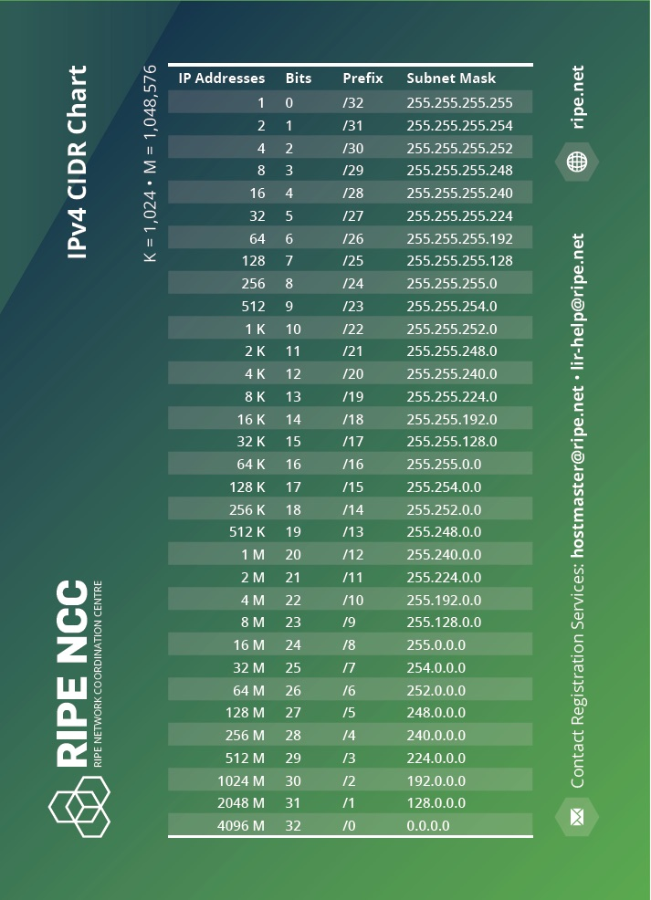

### **Difficulty Level: Beginner 

##### **What you will learn:**
- What an IP address is
- Differences between Public & Private IP addresses 
- WhoIS information for IP Addresses
- ISP / Geolocation Information for IP Addresses 

##### **Requirements:** 
- Web browser


## 🗺 **Overview**  
IP addresses are one of the most fundamental technologies that make up how the Internet works. You may have some idea of what an IP address is, but let's cover some additional things that will help you on your cybersecurity journey. We won't go over everything about an IP address (it's a lot), but we will cover some topics that can be helpful to refresh your memory. Sometimes, certain IP addresses are useful to track from a threat intelligence perspective, as they can be attributed to specific threat actor groups. There's quite a bit to cover, so let's get started!


## **📌What is an IP address? 

An Internet Protocol (IP) address is a fundamental part of networking and Internet connectivity. An IP address is an identifier that allows computers to have an assigned address to identify themselves, and allows the ability to link with other computers that have an IP address. IP addresses have two primary purposes:
- To identify the host computer or network interface 
- To provide the location of the host in the network

There are two types of IP addresses: IP version 4 (IPv4) and IP version 6 (IPv6). IPv4 are 32-bit numbers and are typically human-readable, such as "192.168.1.1", whereas IPv6 are 128-bit numbers that are harder for the human eye to read and memorize. IPv6 isn't fully adopted yet, so we'll focus on IPv4 first, since it is still heavily used on the Internet. I highly suggest researching other resources to learn more about IPv6.

In order to connect to the Internet, a computer (or host) needs a unique IP address to establish connections with other hosts on the Internet. Typically, you would be assigned a public IP address by your Internet Service Provider (ISP), which will be used to connect to the Internet.

What about all the hosts connected to your network? Over WiFi? All the hosts connected to the same network actually share the same public IP address to interact with other hosts on the Internet. But how does that work? Well, a host usually has to be identified both publicly and privately (internally) within their network. This means that a host usually has a Public and a Private IP address.

Let's look at the anatomy of an IPv4 address (from Wikipedia): 


An IPv4 address is 32-bit and are represented in 4 8-bit segments. The numbers on each segment are typically expressed from 0-255. As you can see, the numbers at the top are converted to be human readable, but each segment is typically referred to as an "octet", comprised of the bits that you see below it. 

There are several IPv4 Classes: 
- Class A - any IP address from 0.0.0.0 to 127.255.255.255
- Class B - any IP address from 128.0.0.0 to  191.255.255.255
- Class C - any IP address from 192.0.0.0 to 223.255.255.255
- Class D - any IP address from 224.0.0.0 to 239.255.255.255
- Class E - any IP address from 240.0.0.0 to 255.255.255.255 

Additional information on class networks can be found here: https://en.wikipedia.org/wiki/Classful_network


### Public vs. Private IP Addresses 
As referenced earlier, a public IP address is a unique IP address assigned to your network device, usually a router, by your ISP to connect to the internet. A private IP address is a unique IP address that is assigned to all of the hosts (or devices) in your private network. This means, while you may have 10 computers, 5 laptops, and 3 phones connected to your home network, they all have the same **public** IP address. Internally (or privately), they all have different **private** IP addresses. 

Private IP addresses have specifically reserved ranges within the different classes mentioned above, and they are: 
- IP addresses from **127.0.0.0 to 127.255.255.255** are typically reserved for the loopback range. You'll often see the IP address **127.0.0.1**, which is usually designated as the "localhost". 
- IP addresses from **10.0.0.0 to 10.255.255.255** are reserved for private network IP assignments. 
- IP addresses from **172.16.0.0 to 172.31.255.255** are reserved for private network IP assignments. 
- IP addresses from **192.168.0.0 to 192.168.255.255** are reserved for private netowrk IP assignments. 

There's quite a bit more, which can be referenced here: https://en.wikipedia.org/wiki/Reserved_IP_addresses

### Subnets & Classless Inter-Domain Routing (CIDR)

You'll often see something like a /16 or /24 after an IP address. This is known as the Classless Inter-domain Routing (CIDR) format, which is used to further identify a "block" of IP addresses that may be associated with each other. Here is a handy chart of CIDR notation: 



I highly recommend reading these articles to learn more about IP addressing and subnets: 
- https://www.ripe.net/about-us/press-centre/understanding-ip-addressing
- https://en.wikipedia.org/wiki/Subnetwork


## 🌍 IP Whois Information 

The **"Whois"** protocol (RFC 3912) is a protocol that's used for querying databases that store registered users or assignees of an Internet resource (in this case, IP addresses). Whois information allows you to identify which company or entity owns a specific IP address, and contact information about them. Based on where the IP was registered, it also provides information about where it may be geolocated. This is very useful in threat intelligence, as it allows an analyst to determine the origin of an IP address. 

Further information on the Whois service can be found here: https://www.arin.net/resources/registry/whois/ 

Usually, IP addresses are registered under one of the five Regional Internet Registries (RIRs): 
- The African Network Information Centre (AFRINIC)
- The American Registry for Internet Numbers (ARIN) 
- The Asia-Pacific Network Information Centre (APNIC)
- The Latin American and Caribbean Network Information Centre (LACNIC)
- The Réseaux IP Européens Network Coordination Centre (RIPE NCC) 

Within each of the RIRs IP addresses may be associated and assigned under an Autonomous System (AS). IP addresses are typically assigned an autonomous system number (ASN), which identifies which AS the IP address belongs to. 


## ⌨️ Let's Investigate IP Addresses

### ❓Whois Data

Let's take two IP addresses we'll be working with during this module: 
```
34.160.81.203
194.59.183.30
```

We can quickly get Whois information from a wide variety of sources. In this module, we'll use Whois.com, a free research website that allows you to look up Whois information on IP addresses and domain names. 

- Visit Whois.com here: https://www.whois.com/whois/. Let's search our first IP address, **34.160.81.203**. 

![[ip-3.png]]

Here is the result: 

```
#
# ARIN WHOIS data and services are subject to the Terms of Use
# available at: https://www.arin.net/resources/registry/whois/tou/
#
# If you see inaccuracies in the results, please report at
# https://www.arin.net/resources/registry/whois/inaccuracy_reporting/
#
# Copyright 1997-2023, American Registry for Internet Numbers, Ltd.
#


NetRange:       34.128.0.0 - 34.191.255.255
CIDR:           34.128.0.0/10
NetName:        GOOGL-2
NetHandle:      NET-34-128-0-0-1
Parent:         NET34 (NET-34-0-0-0-0)
NetType:        Direct Allocation
OriginAS:       
Organization:   Google LLC (GOOGL-2)
RegDate:        2021-01-08
Updated:        2021-01-08
Ref:            https://rdap.arin.net/registry/ip/34.128.0.0


OrgName:        Google LLC
OrgId:          GOOGL-2
Address:        1600 Amphitheatre Parkway
City:           Mountain View
StateProv:      CA
PostalCode:     94043
Country:        US
RegDate:        2006-09-29
Updated:        2019-11-01
Comment:        *** The IP addresses under this Org-ID are in use by Google Cloud customers *** 
Comment:        
Comment:        Direct all copyright and legal complaints to 
Comment:        https://support.google.com/legal/go/report
Comment:        
Comment:        Direct all spam and abuse complaints to 
Comment:        https://support.google.com/code/go/gce_abuse_report
Comment:        
Comment:        For fastest response, use the relevant forms above.
Comment:        
Comment:        Complaints can also be sent to the GC Abuse desk 
Comment:        (email@google.com) 
Comment:        but may have longer turnaround times.
Comment:        
Comment:        Complaints sent to any other POC will be ignored.
Ref:            https://rdap.arin.net/registry/entity/GOOGL-2


OrgTechHandle: ZG39-ARIN
OrgTechName:   Google LLC
OrgTechPhone:  +1-650-253-0000 
OrgTechEmail:  email@google.com
OrgTechRef:    https://rdap.arin.net/registry/entity/ZG39-ARIN

OrgAbuseHandle: GCABU-ARIN
OrgAbuseName:   GC Abuse
OrgAbusePhone:  +1-650-253-0000 
OrgAbuseEmail:  email@google.com
OrgAbuseRef:    https://rdap.arin.net/registry/entity/GCABU-ARIN

OrgNOCHandle: GCABU-ARIN
OrgNOCName:   GC Abuse
OrgNOCPhone:  +1-650-253-0000 
OrgNOCEmail:  email@google.com
OrgNOCRef:    https://rdap.arin.net/registry/entity/GCABU-ARIN


#
# ARIN WHOIS data and services are subject to the Terms of Use
# available at: https://www.arin.net/resources/registry/whois/tou/
#
# If you see inaccuracies in the results, please report at
# https://www.arin.net/resources/registry/whois/inaccuracy_reporting/
#
# Copyright 1997-2023, American Registry for Internet Numbers, Ltd.
#

```

This tells us that the IP address belongs to Google. How can we determine if this IP address is used by Google, the company, or users that use Google's services? Well, under one of the comments, it states "The IP addresses under this Org-ID are in use by Google Cloud customers". So this tells us it's a Google owned IP address, and that it is assigned to Google Cloud customers. 

Let's try the other IP address: **194.59.183.30**:
```
% This is the RIPE Database query service.
% The objects are in RPSL format.
%
% The RIPE Database is subject to Terms and Conditions.
% See http://www.ripe.net/db/support/db-terms-conditions.pdf

% Note: this output has been filtered.
%       To receive output for a database update, use the "-B" flag.

% Information related to '194.59.183.0 - 194.59.183.127'

% Abuse contact for '194.59.183.0 - 194.59.183.127' is 'email@bluevps.com'

inetnum:        194.59.183.0 - 194.59.183.127
country:        DE
org:            ORG-BO78-RIPE
netname:        BlueVps
admin-c:        OG3400-RIPE
tech-c:         OG3400-RIPE
mnt-routes:     VPLAB-MNT
mnt-domains:    VPLAB-MNT
mnt-routes:     mnt-ee-bluevps-1
mnt-domains:    mnt-ee-bluevps-1
status:         ASSIGNED PA
mnt-by:         VPLAB-MNT
created:        2023-01-20T10:03:41Z
last-modified:  2023-01-20T10:03:41Z
source:         RIPE

organisation:   ORG-BO78-RIPE
org-name:       BlueVPS OU
country:        EE
org-type:       LIR
address:        Kesklinna linnaosa, Kaupmehe tn 7-120
address:        10114
address:        Tallinn
address:        ESTONIA
phone:          +372 634 6138
admin-c:        OG3400-RIPE
tech-c:         OG3400-RIPE
abuse-c:        AR60040-RIPE
mnt-ref:        mnt-ee-bluevps-1
mnt-by:         RIPE-NCC-HM-MNT
mnt-by:         mnt-ee-bluevps-1
created:        2020-03-11T07:52:56Z
last-modified:  2022-10-21T09:05:59Z
source:         RIPE # Filtered
mnt-ref:        VPLAB-MNT
mnt-ref:        MNT-GLBTX

role:           OLEKSANDR GUTNIK
address:        Kesklinna linnaosa, Kaupmehe tn 7-120
address:        10114
address:        Tallinn
address:        ESTONIA
phone:          +372 634 6138
nic-hdl:        OG3400-RIPE
mnt-by:         mnt-ee-bluevps-1
created:        2020-03-11T07:52:55Z
last-modified:  2020-03-11T07:52:55Z
source:         RIPE # Filtered

% Information related to '194.59.183.0/24AS16276'

route:          194.59.183.0/24
origin:         AS16276
mnt-by:         VPLAB-MNT
created:        2023-01-20T10:41:39Z
last-modified:  2023-01-20T10:41:39Z
source:         RIPE

% This query was served by the RIPE Database Query Service version 1.106 (DEXTER
```

This IP address looks like it belongs to "BlueVPS". If you did some web searching, you'd find that this is a European based Virtual Private Server (VPS) provider, which means this IP address is most likely an IP address of a customer that's using BlueVPS' services. 

Both of thes are great IP addresses to follow up on within your network environment. Do you expect your employees to be connecting using any of these IP addresses? Does your company do business with other companies that use Google Cloud, or BlueVPS, and do you expect traffic to come from these providers? These are great questions to follow up on with your security team. 

### 🌐What about Geolocation? 

There are many companies and services that specialize in identifying where the host behind an IP address is physically located. This involves a mixture of using the Whois information we've identified previously and several proprietary techniques used by these companies. MaxMind is a very popular IP Geolocation company that provides location and fraud detection data for IP addresses. 

We can use their demo to learn more about our 2 IP addresses: https://www.maxmind.com/en/geoip-demo 

![[ip-4.png]]

Submitting the IP addresses give us the following result: 

![[ip-5.png]]

- The first IP, the Google Cloud IP, appears to be geolocated in Kansas City, Missouri in the United States. 
- The second IP, the OVH SAS IP, appears to be geolocated in Germany, Europe. 
	- But wait, didn't we see that it was BlueVPS earlier? Well it turns out, a common thing for smaller hosting providers is to purchase or "lease" IP address space from other hosting providers in bulk. In this case, BlueVPS is leasing that IP address from OVH SAS. 


## 🎉🎉 Hooray! 🎉🎉

You've now learned a little bit more about IP addresses, and learned how to get Whois and Geolocation information to help enhance your understanding of IP addresses that are present in your environment. This will help you make informed decisions in the future, especially when: 
- You are seeing IP addresses coming from countries that your company environment should not be interacting with.
- You are seeing employees or users logging in with abnormal IP addresses, either from a different location or from cloud or hosting providers, instead of residential ISP networks.
- You research an IP address and it's determined to be associated with malicious activity.

Armed with this new information, you can incorporate this knowledge in your daily workflow as an analyst. 

Want to automate IP Geolocation tracking? Check out our Data Enrichment guide on Bulk IP Triage: https://kc7cyber.com/learning-module/bulk-ip-triage/


## Need additional help? 

Join our Slack channel at https://kc7cyber.com/slack and ask us a question! 