##### By Waymon Ho (KC7)

### Difficulty Level: Beginner

##### What you will learn: 
- How to set up your own virtual machine using VirtualBox. 
- How to install a Linux operating system on your virtual machine. 

##### Requirements: 
- Ability to install and run applications on your computer. 

##### Resources: 
- VirtualBox:  https://www.virtualbox.org/wiki/Downloads
- Ubuntu Desktop (Linux): https://ubuntu.com/download/desktop

## Overview 

Ever wanted to play around with Linux or any other operating system without changing your current one? Don't want to buy multiple computers to set up different operating systems? 

In this guide we're going to set up our very own Linux virtual machine. There are many benefits to setting up a virtual machine, including: 
- Installation and usage of multiple operating systems on a single device, running at the same time.
- Keeping different projects, data, or work separate across different virtual machines.
- Allows the use of creating "snapshots", to revert your virtual machine back to a saved point in time. 
	- This includes reverting back if you accidentally mess up your virtual operating system! 
- Allows you to work in an isolated environment away from your personally identifiable information. 

If any of this interests you, let's get going! 

## Getting Started 

We're going to be setting up a virtual with a popular and user-friendly Linux operating system, Ubuntu. 

#### Step 1: Download & Install VirtualBox 

Visit https://www.virtualbox.org/wiki/Downloads and download VirtualBox. We'll be working on a Windows computer today, so we'll download the **'Windows hosts'** installer. If you're using MacOS or other distributions, download those installers instead and install them. 

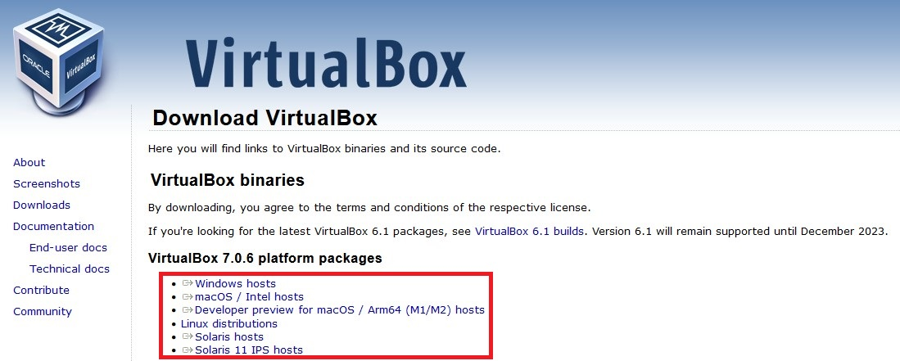

A file should be downloaded. Go ahead and launch the executable: 

Follow the steps through the installation process: 

- Click '**Next**'.

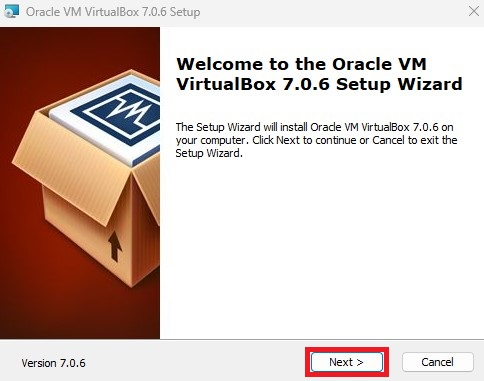

- Click '**Next**'.

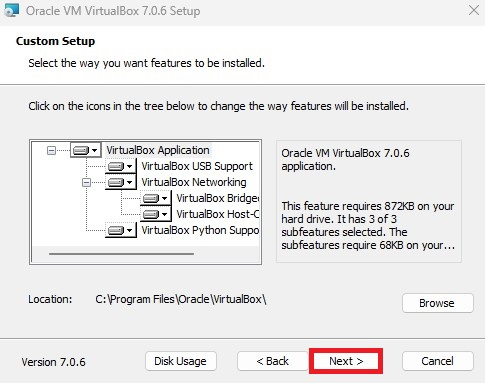

- Click '**Yes**'.

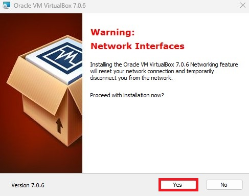

- If this window pops up, click '**Yes**'.

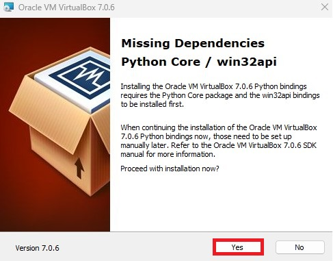

- Click '**Install**'.

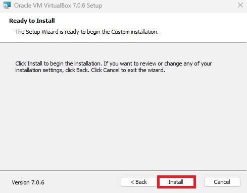

- Wait for the software to install. 

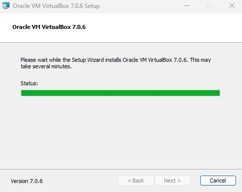

- Click '**Finish**'. Click on '**Start Oracle VM VirtualBox 7.0.6 after installation**'. 

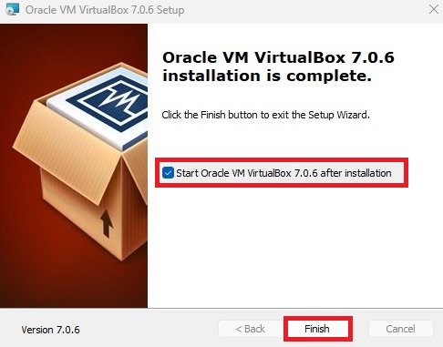

**Note:** Sometimes the installer doesn't open VirtualBox. If you don't see it launch, search for 'VirtualBox' and start it. 

You should see the '**Oracle VM VirtualBox Manager**' window open. If you see something similar to the screenshot below, you're good to go! 

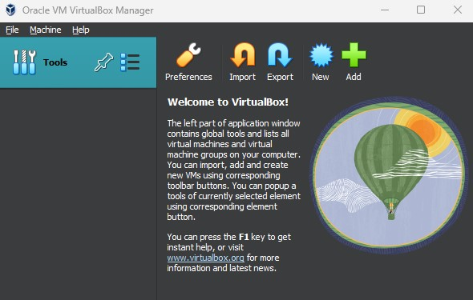

#### Step 2: Download Ubuntu Desktop

Visit https://ubuntu.com/download/desktop and download the latest version of Ubuntu Desktop. At the time of this guide, Ubuntu 22.04.2 LTS is the latest version of Ubuntu Desktop offered by Ubuntu. 

- Make sure you're on the 'Download Ubuntu Desktop' page, and click on the green 'Download' button under the Jellyfish. 

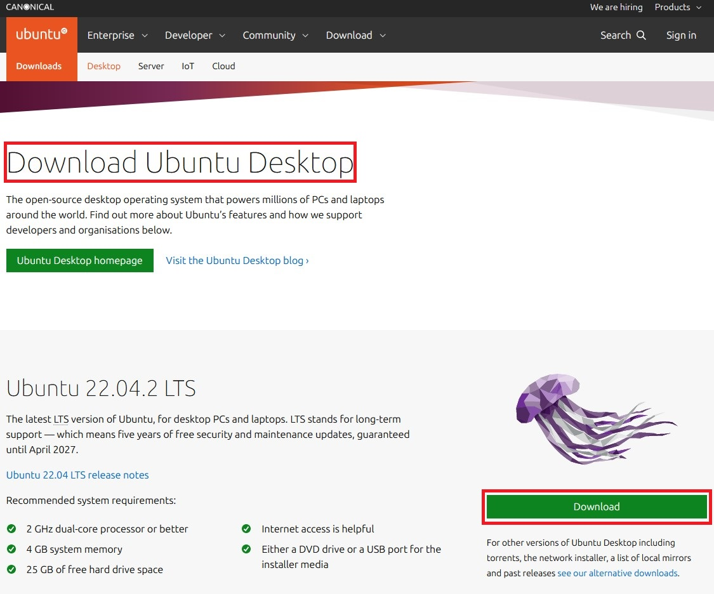

A file like this should be downloaded to your computer: 

**Note:** You're downloading a whole operating system, so this may take a while. As you can see from the above screenshot, the .iso file for Ubuntu Desktop is approximately 4.6 gigabytes. Go and have a snack while you wait! 

## Virtual Machine Installation 

Now that we have VirtualBox installed and have a copy of Ubuntu Desktop downloaded, let's go ahead and set up our virtual machine.

#### Step 1: Creating the Virtual Machine 

- Open VirtualBox and click on '**New**'
	- You can also click on '**Machine**' **>** '**New**' or press **CTRL + N**.

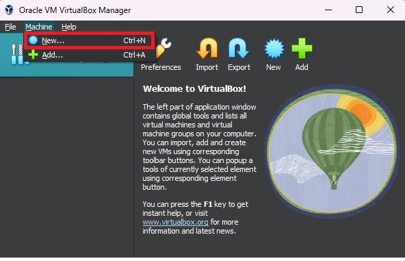

- Enter a name for your virtual machine and set the folder where you want to save the virtual machine to. 
- Under '**ISO Image**', click on the dropdown and navigate to your downloaded Ubuntu desktop image that you got from the '**Getting Started**' section. 
- Set the '**Type**' to Linux and '**Version**' to your operating system version. In this guide, it is '**Ubuntu 22.04 LTS (Jammy Jellyfish) (64-bit)**'

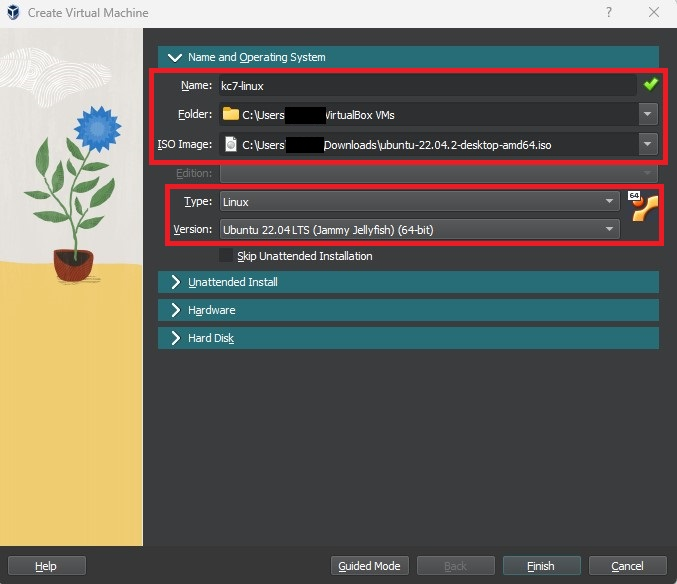

- Click on '**Unattended Install**' and set your username and password. We will use "**kc7cyber**" as the username and password in this guide. 
- Set a **hostname**. We will use '**kc7-linux**' in this guide. 
- Check "**Guest Additions**" and navigate to VirtualBox's Guest Additions ISO image. On Windows operating systems, this is typically located in the '**Program Files**' Folder listed in the screenshot. 

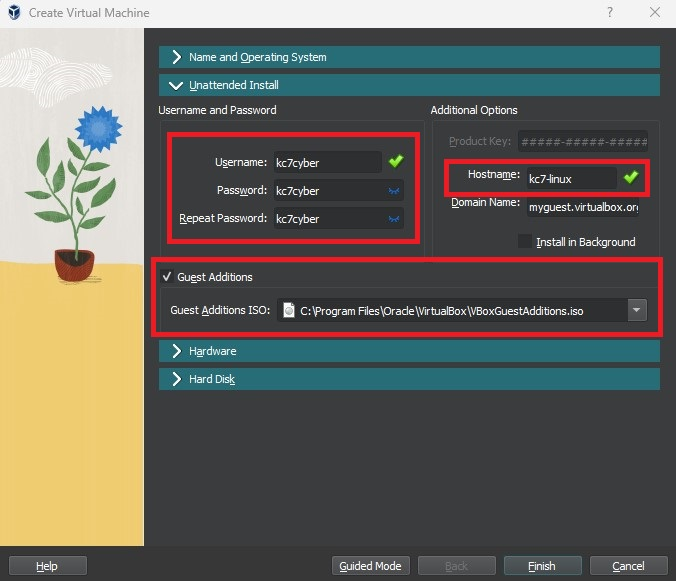

- Click '**Hardware**'. Set your Base Memory and Processors to something manageable for your virtual machine. It isn't necessary to give it a lot of resources. In this guide, I'm using 8 GB of RAM and 2 Processor cores. 
	- I recommend setting it to at least 4GB of RAM and 2 processor cores. 

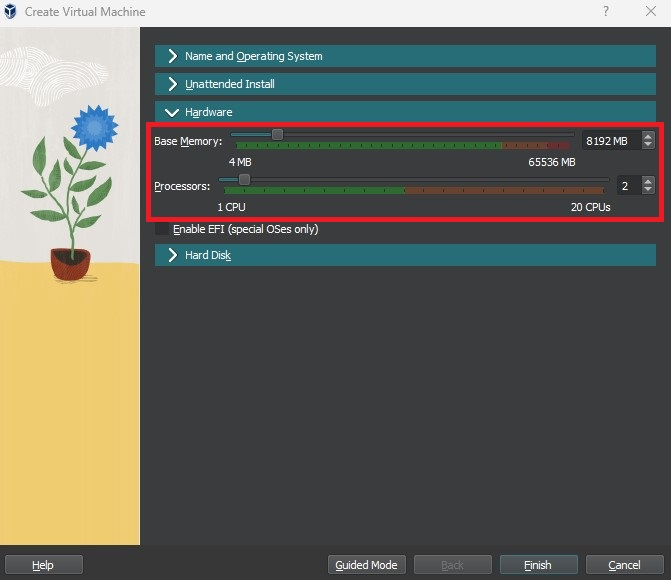

- Click on '**Hard Disk**' and make sure it's on '**Create a Virtual Hard Disk Now**'. You can leave the default hard drive location, but set the size of the hard drive for the virtual machine. In this guide, I left it as 25 gigabytes. 
- Once you're done, click '**Finish**'. 

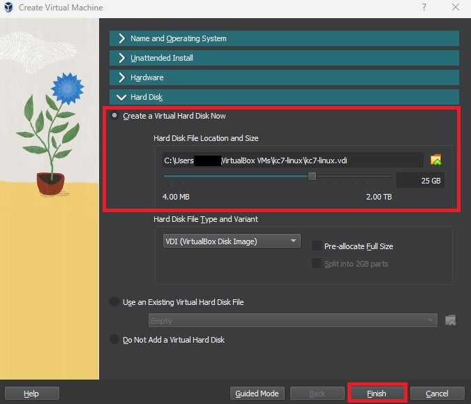

#### Step 2: Sit back and Relax! 

Your VirtualBox application should start creating the virtual machine now. It might restart on its own, just leave it alone and have a sip of coffee while you wait.

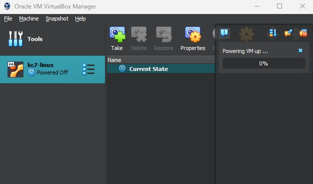

- The Ubuntu logo should appear and start running. You don't need to click anything until it's done installing. 

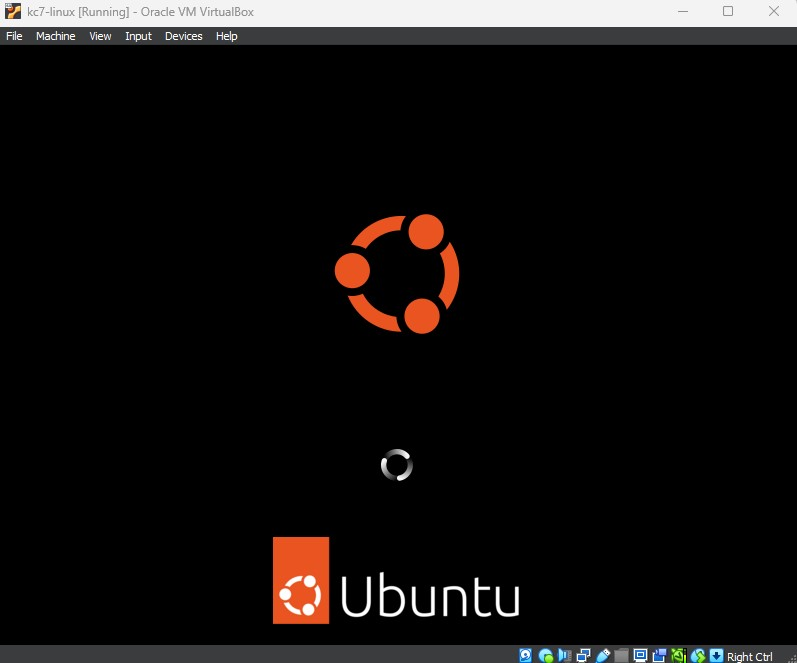

- An installation window should start up and proceed to install stuff. 

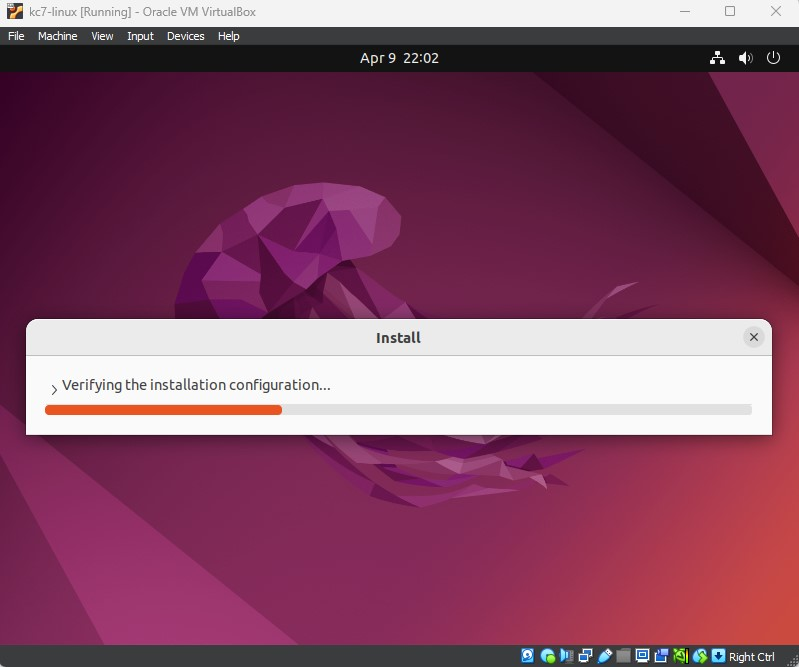

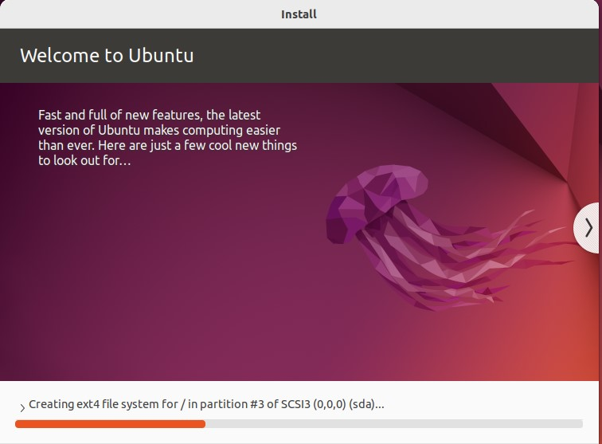

- Once it's all done, you should see the login screen with your username.

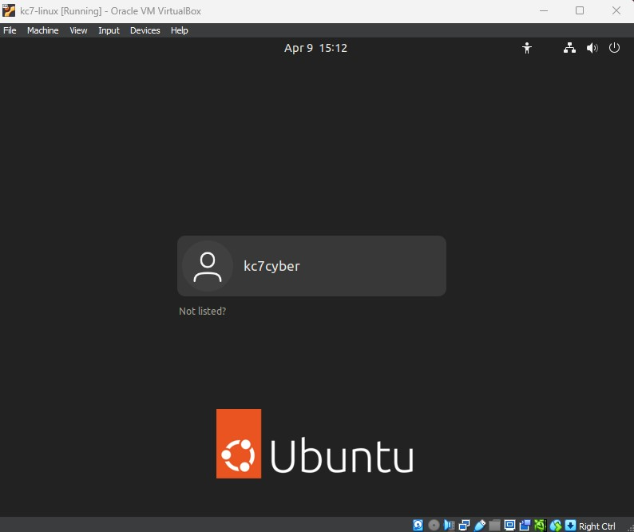

#### Step 3: Making sure things work 

Go ahead and log in to your virtual machine. You'll start getting some prompts when you run it for the first time. 

- I'm going to only use this virtual machine for cybersecurity projects, so I don't want to connect any personal accounts right now. I'll click '**Skip**'.

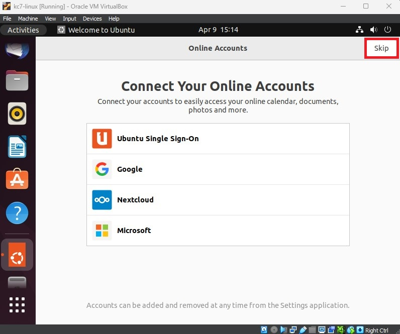

- I'm not going to Enable Ubuntu Pro. Click '**Next**'.

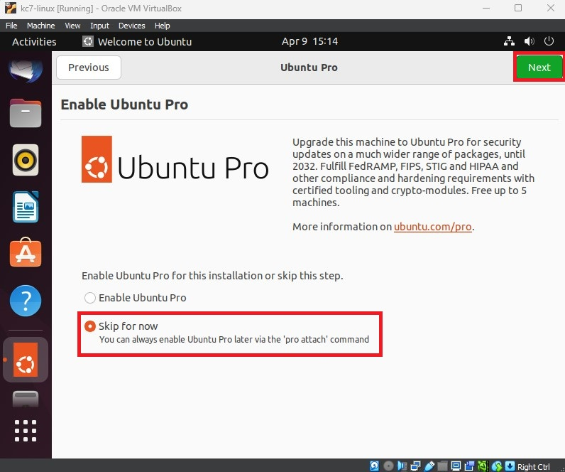

- I'm not going to send any system information to Ubuntu. Click '**Next**'. 

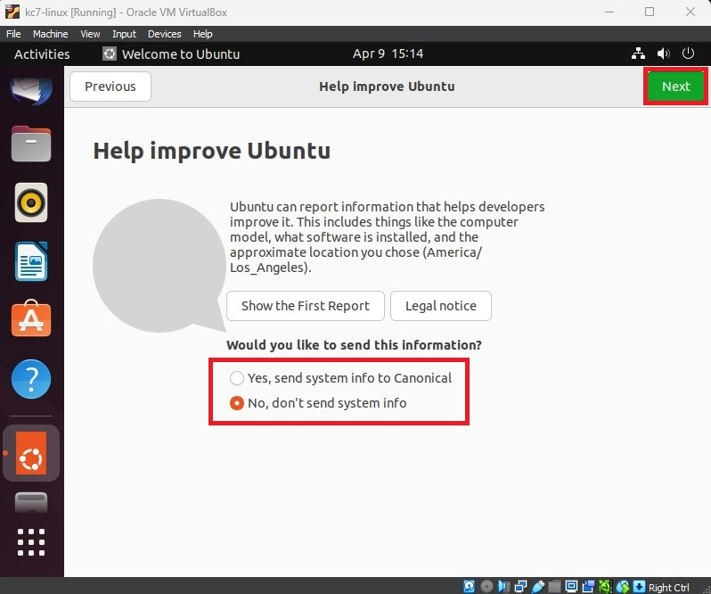

- Turn off Location Services. Click '**Next**'. 

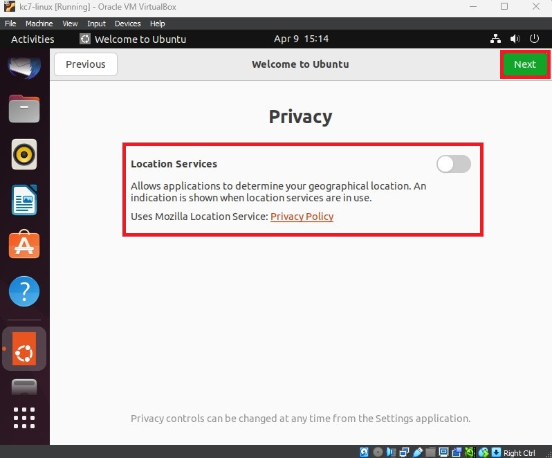

- Click '**Done**'. You can open the '**Software**' application at any time to install any applications you'd like afterwards. 

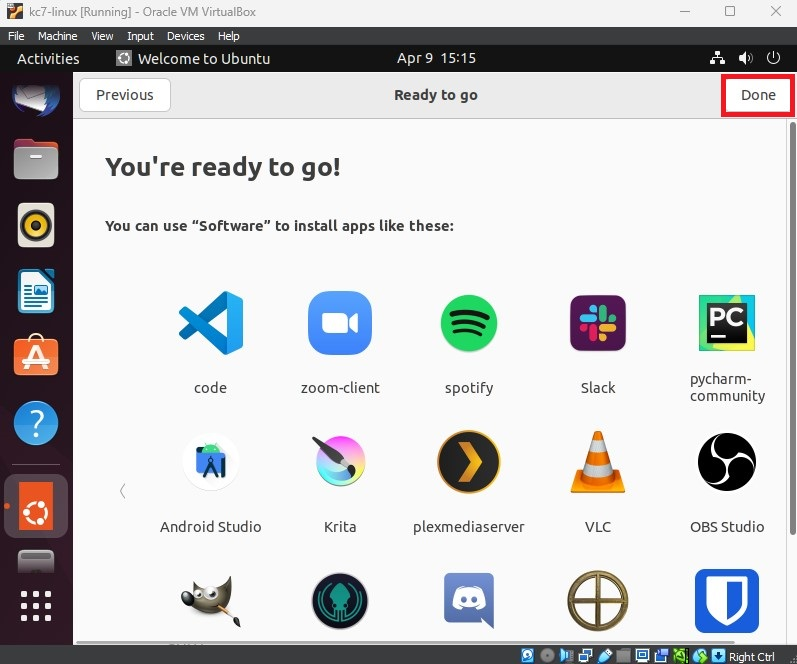

**🥳 You're all set! You can start using your virtual machine! 🥳**

#### (OPTIONAL}) Step 4: Creating a Snapshot 

Snapshots are a great way of reverting changes you've made to your virtual machine. Did you accidentally install something that messed up your whole virtual operating system? Is it cluttered and messy and you just want to start all over again? No worries! You can easily make snapshots to revert back to different machine states. 

Let's make a snapshot now before we make any more changes to our virtual machine. 

- On the VirtualBox window, click on '**Machine**', and then click on '**Take Snapshot**'

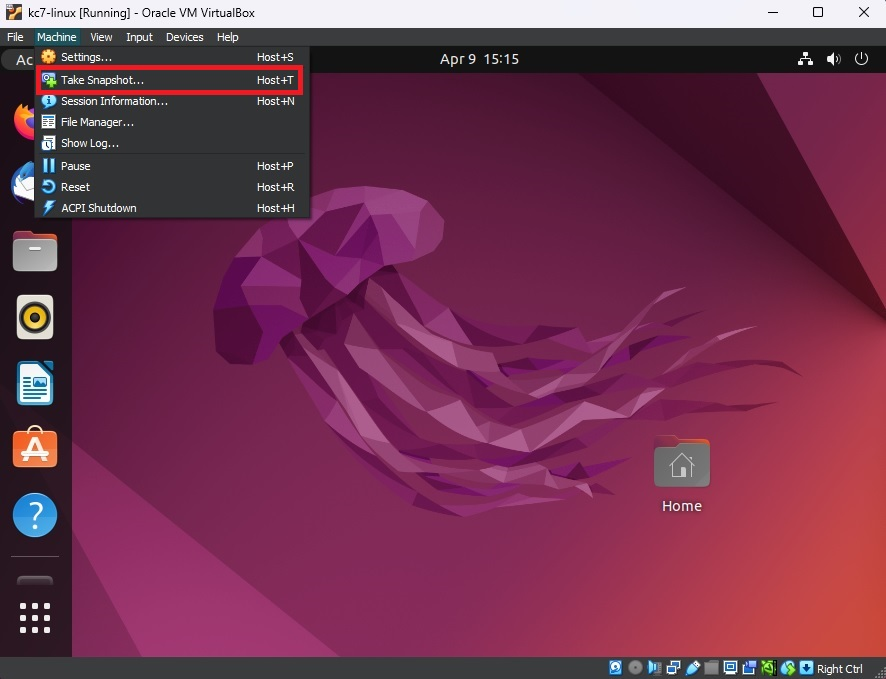

- Give your snapshot a name. I'm going to use '**Clean Installation**' so I know I this snapshot will revert me back to a brand new install when I use it. 

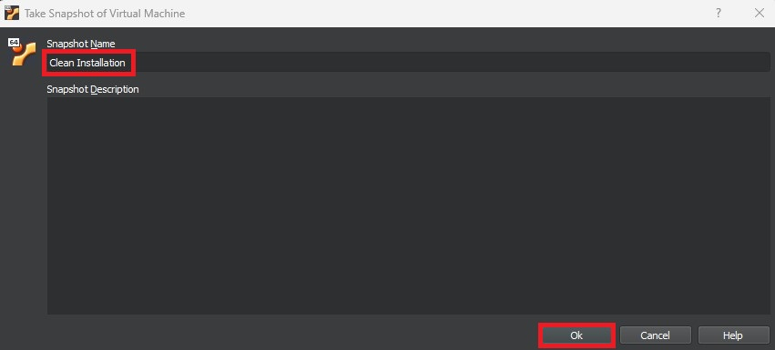

- Wait for VirtualBox to take the snapshot. 

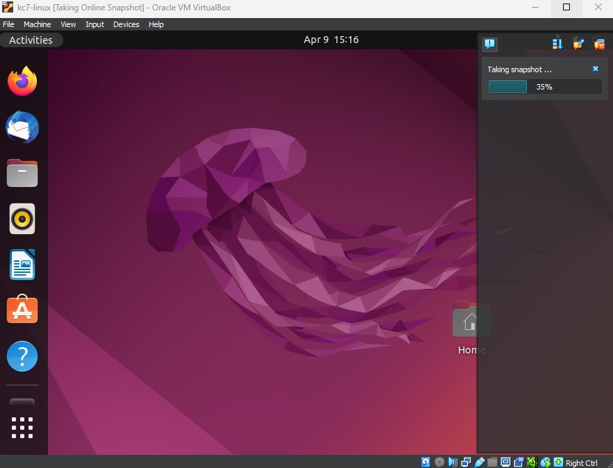

- And we're done! If you ever need to revert a snapshot, you can turn off your Virtual Machine and then reset it using the the VirtualBox application. 
- You can click on your virtual machine to the left and select the snapshot you'd like to revert back to, and then click '**Restore**'. 

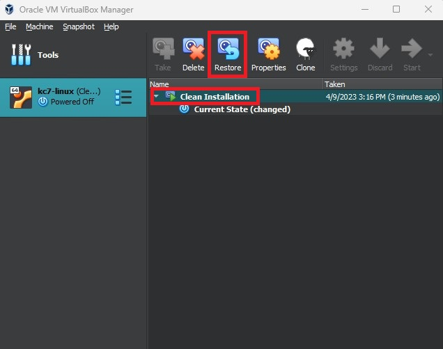

Now you're free to explore your newly made virtual machine without worrying about any disasters and having to reinstall it again. 

## Need additional help? 

Join our Slack channel at https://kc7cyber.com/slack and ask us a question! 