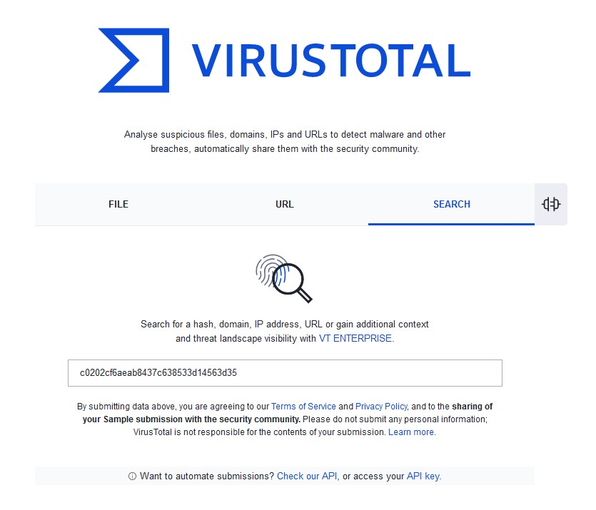
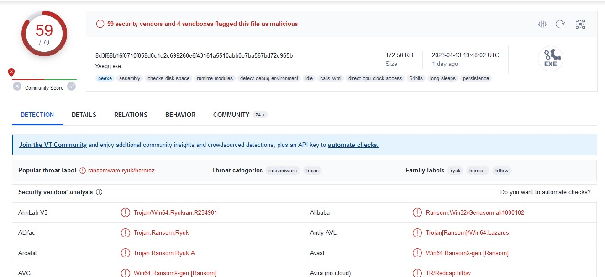
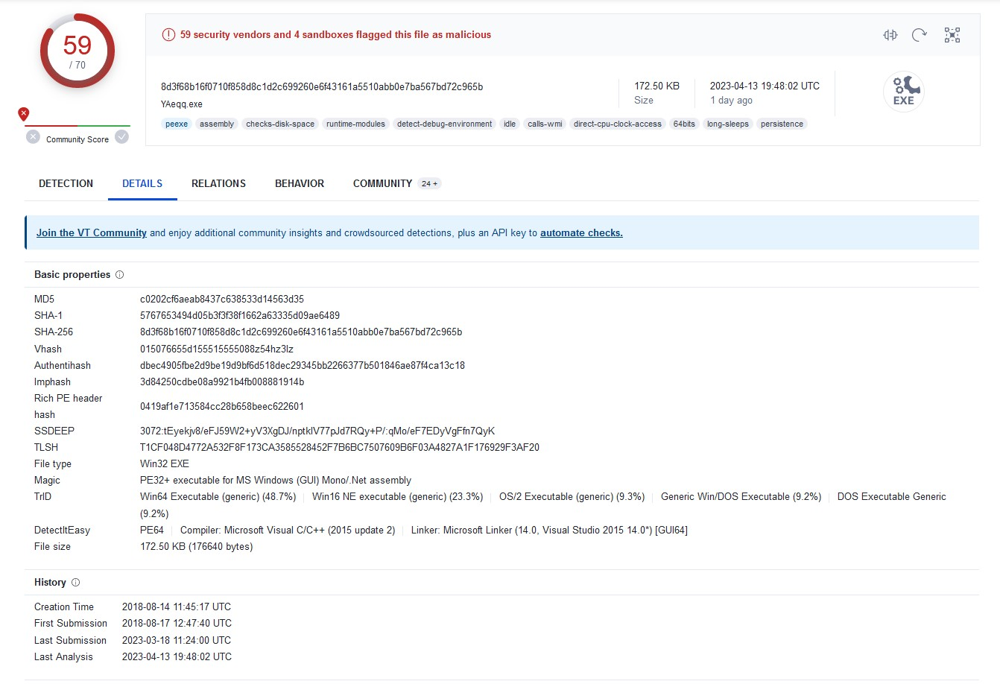
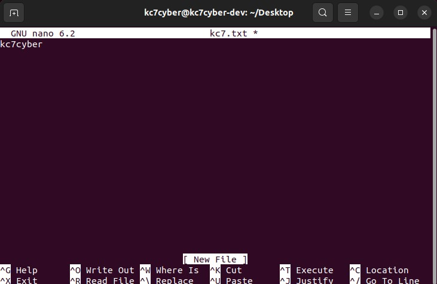
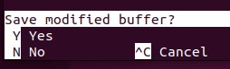
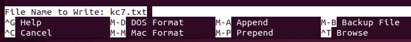
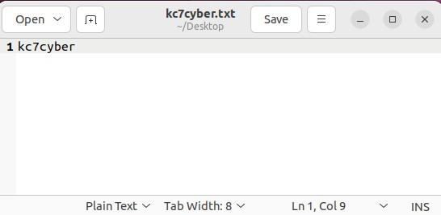
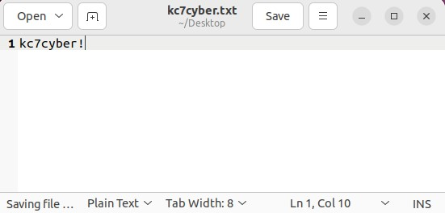

##### By Waymon Ho (KC7 Team)

### **Difficulty Level: Beginner** 

##### **What you will learn:**
- What a "file hash" is and why it's important in threat intelligence and digital forensic investigations 
- 3 Commonly used Cryptographic Hashing Algorithms: 
	- Message Digest 5 (MD5) 
	- Secure Hash Algorithm 1 (SHA1) 
	- Secure Hash Algorithm 256 (SHA256) algorithms
- How to investigate a file hash using VirusTotal 
- How to generate your own hashes 

##### **Optional Requirements:** 
- Linux Operating System for generating file hashes
- A Virtual Machine environment
	- You can follow our setup guide here for both: https://kc7cyber.com/learning-library/setting-up-a-linux-virtual-machine/

#### **Resources:** 
- Fact sheet on file hashes:
	- https://www.cisa.gov/sites/default/files/FactSheets/NCCIC%20ICS_Factsheet_File_Hashing_S508C.pdf


## 🗺 **Overview**  

If you're in the cybersecurity industry, you will eventually end up investigating and working with "**file hashes**". File hashes are generally represented as a unique sequence of alphanumeric characters, that is meant to represent what some call a "digital fingerprint". That is, a text representation of data. This means a text representation of a text file, a picture, a video, even an entire hard drive on a computer. There are many uses for hashing, including data verification, authenticity (has not been altered), and for tracking file travel. In this guide, we'll go over how file hashes are created, the common algorithms used to create them, why they're important in the digital forensics and threat intelligence fields, and how to investigate them using VirusTotal. We'll even learn how to generate our own so we can understand how it works. 

## **📌Getting Started** 

For general file hash investigation and generating our hashes, we'll be using the following environment: 

- A Linux operating system (this guide will use **Ubuntu Desktop 22.04 LTS**)

<hr>

🔔**Note:** It's highly recommended you set up a virtual machine environment for this. This helps keep your code and work separate from your personal data. 

For a detailed guide on how to set up a free virtual machine with a Linux operating system, please visit: https://kc7cyber.com/learning-library/setting-up-a-linux-virtual-machine/

<hr>

Once you're set up with an Ubuntu environment, let's start looking into file hashes. 


## 🧬 What are File Hashes, and what do they look like? 

A file hash is a way to apply a unique identifier to a piece of data, usually a file or section of data. These hashes are usually alphanumberic text representations. For example, if I have a Microsoft Word document called "my_essay.docx" that's 200 pages long, the file, include the contents within the file, can be represented as: 

```
a606bb931c5ec8dc17755b6355b37a70c1701e01cf500e447834ee26069bf588
```

using the SHA256 hashing algorithm. One important thing to note here is that this represents the content of the file, not the name. If I changed the name to "my_long_essay.docx" without changing anything within the file, the file hash should still be the same. However, if I had a single space, a single letter anywhere in the document and save it, the file hash will change drastically, and can even be something like: 

```
61780df08a2f316936c0934291e20d3cf54fd486df19a9cc8cc89d4afef20f38
```

The smallest change in a file's contents can drastically change the file hash. We'll go over this at the end of our guide where we generate our own file hashes. 


## 🔍 Why are File Hashes Important? 

File hashes have many use cases in different fields within cybersecurity. 

- For **digital forensic investigations**, it proves that the uniqueness of the data and it serves as the representation that the data is authentic and original. 
	- This is commonly used by digital forensic examiners to prove that they did not alter the data, especially on a computer device or hard drive, in any way throughout the investigation process. Remember, adding even the tiniest change in the content will result in a completely different file hash. Digital forensic examiners usually generate a file hash of the digital evidence they're investigating in the beginning, so that they can prove the evidence did not change throughout their investigation as they identify criminal activity. 
	- These are also used to track and find files within a device. For example, explicit or illegal file content can be identified based off of the unique file hash from the files on the device. This saves the investigator time by not having to open every single file to see what's on there. 

- For **threat intelligence investigations**, it allows analysts to identify malicious files, and track file travel across several systems. 
	- A particular strain of malware, usually in the form of an executable file, has a unique hash related to it. Let's say one of the hashes is related to ransomware. If an analyst is able to identify the unique hash associated with it, every time it's seen, you'll know it's that specific ransomware. 
	- It can also track file travel. For example, if malware moved across several computers in a compromised environment and you have its file hash, you will know which computers they've infected and when they compromised it by seeing when they were created on that machine. It also allows you to identify if sensitive or critical information from your company is being stolen or moved to another computer. 

- There are many other uses for file hashes. It is an important piece of evidence and identifier to track in cybersecurity. 

## 🗃 Common Hashing Algorithms 

There are three common file hashing algorithms used in the cybersecurity and law enforcement community. These algorithms are cryptographic algorithms that take data and create a unique textual representation of the data. The algorithm is one-directional, meaning it will create the hash based on the data, but it cannot be reversed. This means you cannot take a file hash on its own and turn it back to the data. Don't worry though, there's other ways to investigate this. 

The three common cryptographic hashing algorithms are: 
- Message Digest 5 (**MD5**) - **MD5** hashes produce a 128-bit hash value, which is typically represented as 32 characters (hex format). This is a commonly used hashing standard in law enforcement for digital forensics investigations. 
	- **Example of an MD5 File Hash**: 
```
c0202cf6aeab8437c638533d14563d35
```

- Secure Hash Algorithm 1 (**SHA1**) - **SHA1** hashes produce a 160-bit hash value, which is typically represented as 40 alphanumeric characters (hex format). It was designed by the NSA, and is still used today. However, most of the industry has adopted its newer algorithm: SHA256.
	- **Example of a SHA1 File Hash**: 
```
5767653494d05b3f3f38f1662a63335d09ae6489
```

- Secure Hash Algorithm 256 (SHA256) - SHA256 hashes produce a 256-bit hash value, which is typically represented as 64 alphanumeric characters (hex format). This is the most commonly used file hashing algorithm today due to its security against collission attacks. 
	- **Example of a SHA256 File Hash:** 
```
8d3f68b16f0710f858d8c1d2c699260e6f43161a5510abb0e7ba567bd72c965b
```


<hr>

**👀 Collisions?!:** Scientifically, MD5 and SHA1 hashes have been proven to have collisions. What this means that while the chances are extremely low (almost zero), it is possible for two completely different files to have the same MD5 or SHA1 file hash. One distinction to be made here, and this is one that is usually made in court testimony by digital forensic investigators, is that while it's possible two files can have the same hash, the content of those files are most likely wildly different. An example being a text file with the word "crime" in it. There exists a chunk of data that can be hashed to be the same file hash as that text file, but it would most likely not be another text file, and just a random series of data that is not interpretable by the computer. Still, this is a reason why many have switched to SHA256 file hashes, as there is currently no known file hash collisions. 

<hr>


## 📡 How do we investigate file hashes? 

One of the common uses of file hashes is to track malware, or malicious software. There are many sites that allow you to investigate file hashes. One of these websites is VirusTotal. VirusTotal is a website that analyzes suspicious files, URLs, domains, and IP addresses to detect malware and other types of threats, and provides a report. You can submit any of these indicators, including uploading a file, to have VirusTotal scan the data across approximately 70 different anti-virus engines. VirusTotal is free to use but offers an enterprise version. 

Let's investigate one of our file hashes from the previous section: 
```
c0202cf6aeab8437c638533d14563d35
```

Visit VirusTotal at https://www.virustotal.com/gui/home/.

On this page you can upload a file, submit a URL for scan, or search their database. We will click on the **"Search"** tab and submit our file hash to search. 



Press **"Enter"**. You should see a new page with some red flags: 



This file was flagged malicious by 59 vendors! Looking at the name it appears to be ransomware, specifically the Ryuk ransomware as reported by some vendors. Let's investigate further by going to the **"Details"** tab. 



You'll have some basic file properties and additional information about the file itself. Feel free to explore the rest of VirusTotal's tabs, which include: 
- **"Relations"** - any related network, IP address, and files observed by VirusTotal 
- **"Behavior"** - behavioral information about the file once it's executed in VirusTotal's sandbox environment 
- **"Community"** - Any comments or observations made by other analysts in the VirusTotal community 

It is important to keep track of file hashes as you conduct your investigations. If you're able to cluster threat activity together, you may identify which files are used by specific threat actor groups. This allows you to make assessments on whether or not a specific group, such as an nation state or financially-motivated threat actor, is responsible for an attack. 


## 🔨 Let's make our own hashes! 

That's a lot of content to digest. Let's go and create our own hashes to see how it works. If you haven't set up your Ubuntu environment yet, I would recommend visiting the **Getting Started** section before proceeding. 

- Let's open up a Linux terminal and navigate to the **Desktop** folder. 

```
$ cd ~/Desktop 
```

- We're going to use a terminal based editor called **Nano**. Let's make our file: 

```
$ nano kc7.txt
```

A new screen will pop up. Let's try writing the text **"kc7cyber"**, no spaces, quotes, new lines, etc. Just **"kc7cyber"** in the text file. 



- Now, we're going to press **CTRL+X**. A new screen will pop up asking if you'd like to save the modified buffer, press **Y**. 



- It's going to ask you the File Name to Write. It should already be populated with "**kc7.txt**", so let's press **Enter**. 



Now you should have a file called **"kc7.txt"** on your Desktop folder. 

```
kc7cyber@kc7cyber-dev:~/Desktop$ ls -al
total 20
drwxr-xr-x  4 kc7cyber kc7cyber 4096 Apr 15 10:43 .
drwxr-x--- 21 kc7cyber kc7cyber 4096 Apr  9 21:27 ..
-rw-rw-r--  1 kc7cyber kc7cyber    9 Apr 15 10:43 kc7.txt
```

- Let's try an MD5 sum. We can do that natively with our Linux environment by typing the following command and pressing Enter: 

```
$ md5sum kc7.txt 
7344f73e324c21e8b94cf47efa43f11f  kc7.txt
```

You should have the exact same file hash: 7344f73e324c21e8b94cf47efa43f11f. 

- Let's try making another text file with the same content using a different program. On the top left of your Linux machine, click on the **"Activities"** button and search for **"Text Editor"**. Click on the icon to open it. 

- We'll do the same thing. Put just the text **"kc7cyber"** in the file. Let's save it as **"kc7cyber.txt"** in the **Desktop** folder. 



- Now let's try hashing that file with MD5: 

```
$ md5sum kc7cyber.txt 
7344f73e324c21e8b94cf47efa43f11f  kc7cyber.txt
```

They both match! As you can see, the file name does not affect the file hash, **only the contents of the file**. This is because the cryptographic hashing algorithms generate the hashes based on what's contained within the data. If you were doing this on a Microsoft Word document, it would be a completely different hash, mainly because it is a different file type (.docx), which is interpreted and read differently by the computer. 

- We can hash both of these files using SHA1 and SHA256. We can actually do them at the same time, by using the following commands:

```
$ sha1sum kc7*.txt
792b32739c7e1c120b4c07d02f2405e7dd88bd32  kc7cyber.txt
792b32739c7e1c120b4c07d02f2405e7dd88bd32  kc7.txt

$ sha256sum kc7*.txt
6a357696ba95570c99bc81de6ad1c94b7757694cba6f9437c57ff2ec992ad81d  kc7cyber.txt
6a357696ba95570c99bc81de6ad1c94b7757694cba6f9437c57ff2ec992ad81d  kc7.txt
```

Using the **"\*"** operator allows you to set a *wildcard*. The command is essentially saying "give me all .txt files that start with kc7" and then using the **sha1sum** and **sha256sum** commands to calculate the file hashes. 

- Now let's make a slight change. Let's edit our text file to have a **!** at the end: 



Save the file. You can also do this using **Nano** for the **"kc7.txt"** file by typing: 
```
$ nano kc7.txt
```

and adding the **!** to that text file, press **CTRL+X**, then **Y**, and finally pressing **Enter**. 

- Let's see how what the hashes are now for these files: 
```
$ md5sum kc7*.txt
1ff4035009de30faeae16321b19e1431  kc7cyber.txt
1ff4035009de30faeae16321b19e1431  kc7.txt

$ sha1sum kc7*.txt
c7a680262278d4170389a0c0afe5ff89bcdd4206  kc7cyber.txt
c7a680262278d4170389a0c0afe5ff89bcdd4206  kc7.txt

$ sha256sum kc7*.txt
fa856751852d579dabe11f45b636a1d4a97d9c71d8670eed107ccdaff8e95829  kc7cyber.txt
fa856751852d579dabe11f45b636a1d4a97d9c71d8670eed107ccdaff8e95829  kc7.txt

```

They're completely different! This shows that even the smallest changes, including adding a single character, will result in a completely different file hash. I encourage you to play around with other file types to see how they differ. 

Stay tuned for our Digital Forensics series (coming soon) which will talk about how to generate hashes for more than just files. We'll go over hashing disk images, digital forensic evidence containers, and more! 

## Need additional help? 

Join our Slack channel at https://kc7cyber.com/slack and ask us a question! 

