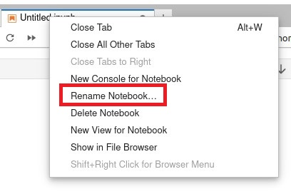

##### By Waymon Ho (KC7 Team)

### **Difficulty Level: Intermediate** 

##### **What you will learn:**
-   How to investigate IP addresses using Censys.io's Search tool. 
-   How to use Python and Jupyter Notebook to create a re-usable investigative tool to triage multiple IP addresses at once. 
-  Learn basic data manipulation using Python and Pandas. 

##### **Requirements:** 
- Basic understanding of: 
	- Programming concepts 
	- Python (Version 3)
		- Using Pandas and Jupyter Notebooks
	- Linux Operating System & Command Line 
	- IP Addresses 
- A Linux Operating System, such as Ubuntu Desktop
	- https://ubuntu.com/download/desktop

##### **Optional** 
- A Virtual Machine environment
	- You can follow our setup guide here: https://kc7cyber.com/learning-library/setting-up-a-linux-virtual-machine/

#### **Resources:** 
- On IP Addresses: 
	- https://en.wikipedia.org/wiki/IP_address
	- https://www.arin.net/resources/manage/irr/
	- https://www.arin.net/resources/registry/whois/
	- https://www.arin.net/resources/guide/asn/
- On Censys.io 
	- https://censys.io/
	- https://github.com/censys/censys-python
	- https://censys-python.readthedocs.io/en/stable/index.html

## 🗺 **Overview** 

***Data enrichment*** involves combining data from internal sources (such as IP addresses from your log data or SIEM) and enriching it from other data sources, including third-party external sources. A very common investigative technique that cybersecurity analysts pursue is identifying additional information about an IP address, including which ***internet service provider (ISP)*** is assigned to it and its approximate ***geographic location (geolocation)*** in the world. We've investigated some of this information using MaxMind GeoLite2 databases in a separate learning module, but today we're going to dive deeper into IP addresses, including getting information about **hosted services** and **open ports** at that IP address, and the data that Censys is able to **scrape** from them.  

If you've investigated IP addresses before, you know how time consuming it can be to look up an IP address one at a time. What about in a SOC environment, where you may have to investigate hundreds of IPs in a short amount of time? In this guide, we will go over what data Censys.io's databases provide and how to utilize Python code to create a tool that can bulk triage IP addresses to get the information you need.  

With that in mind, let's get started on our journey towards making a cool IP triage tool using Python! 

## **📌Getting Started** 

Here's what we're going to be using for our environment: 
- A Linux operating system (this guide will use **Ubuntu Desktop 22.04 LTS**)
- Python (version 3)
	- pip3
	- virtualenv
	- pandas
	- Jupyter Lab
	- Censys.io's Python module

<hr>

🔔**Note:** It's highly recommended you set up a virtual machine environment for this. This helps keep your code and work separate from your personal data. 

For a detailed guide on how to set up a free virtual machine with a Linux operating system, please visit: https://kc7cyber.com/learning-library/setting-up-a-linux-virtual-machine/

<hr>

### **Step 1: Install the required Linux packages

Let's make sure our environment is set up correctly. Open up a Linux terminal and run the following commands: 
```
$ sudo apt-get update
$ sudo apt-get upgrade 
```

Now let's install our required Python packages: 
```
$ sudo apt install python3-pip
$ sudo apt install build-essential libssl-dev libffi-dev python3-dev
$ sudo apt install python3-venv
```

### **Step 2: Set up your virtual environment and install the required Python packages**

Navigate to where you want to save your Python environment and Jupyter notebook. In this case, I'm going to use my Desktop folder. 
```
$ cd ~/Desktop
$ mkdir kc7-projects
$ cd kc7-projects/
```

Now let's set up our Python 3 virtual environment and activate it: 
```
$ python3 -m venv kc7-jupyter
$ cd kc7-jupyter
$ source bin/activate
```

You should see the **"(kc7-jupyter)"** displayed on your terminal on the left side: 
```
(kc7-jupyter) kc7cyber@kc7cyber-dev:~/Desktop/kc7-projects/kc7-jupyter$ 
```

Let's do some installations via pip3: 
```
pip3 install pandas censys tabulate
pip3 install jupyterlab
```

Once JupyterLab is installed, launch it using the following command:
```
$ jupyter-lab
```

A web page should pop up similar to the image below. If it doesn't, look at your terminal, there should be some links to open your JupyterLab environment using the URLs provided to you. 


### **Step 3: Sign up for a Censys.io Account and get your API keys**

Visit https://accounts.censys.io/register to sign up for a Censys.io account. You will need to use a valid email account to sign up and verify with. If you're a student, feel free to put 'Student' or your college as your organization. 

Once you've signed up and verified your email, log in to your account and head over to **Censys Search** at https://search.censys.io/ and sign in. Click on your account icon on the top right and select **"My Account"**. Under **"My Account"**, click on the **"API"** tab to view your API key. 


### **Step 4: Set your Censys configuration on Python**

- Make sure you're still on your virtual environment: 

```
(kc7-jupyter) kc7cyber@kc7cyber-dev:~/Desktop/kc7-projects/kc7-jupyter$ 
```

- Type the following code to start the configuration process: 

```
$ censys config
```

- Fill out the following prompts using the API information you have on your Censys.io account. You should receive a message saying your account was successfully authenticated. 

```
Censys API ID: <ENTER YOUR API ID FROM THE WEBSITE HERE>
Censys API Secret: <ENTER YOUR API SECRET FROM THE WEBSITE HERE>
Do you want color output? [y/n]: y

Successfully authenticated for <your email address> 
```

Let's start coding! 

## 📓 Creating the Jupyter Notebook 

<hr> 

🎯**Key Note - Why Jupyter?**
Jupyter is a great environment that allows you to build, test, and run code in small sections. It also provides you with a visual interface on a web page, and takes away the barrier needed to run Python code manually. The best part? Jupyter Notebooks can be shared amongst the rest of your team! 

<hr> 

Let's start by creating a new Notebook. You can right click on the directory tree to the left and click on **"New Notebook"** or click on the **"Python 3 (ipykernel)"** under the **"Notebook"** section on the **Launcher** page. 


- When asked to select a kernel, just use the default listing and click **"Select"**. 


- Right click on the tab with the new Notebook and click on **"Rename Notebook..."** 


- Let's call it: **"Censys.ipynb"**.


Now that our environment is all set up, let's start building out our tool.

## ⌨️ Let's Code! 

<hr> 

### **🚨WARNING🚨: We will be diving straight into using Python, JupyterLab, and Pandas. If you are unfamiliar with any of these things, you may want turn back and return once you get some experience with using them.** 

<hr>

Visit https://github.com/censys/censys-python for more documentation on Censys' Python module. 

- Let's go back to our **"Censys.ipynb"** notebook. 


- import the censys, pandas, and json module on the first cell. 

```python
from censys.search import CensysHosts
import pandas
import json
```

- Now, let's set a CensysHosts. 