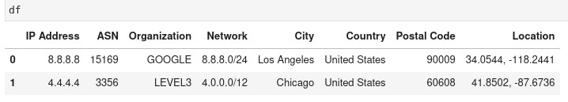

##### By Waymon Ho (KC7 Team)

### **Difficulty Level: Intermediate** 

##### **What you will learn:**
-   How to investigate IP addresses using the MaxMind GeoIP2 database. 
-   How to use Python and Jupyter Notebook to create a re-usable investigative tool to triage thousands of IP addresses (or more) at once. 
-  Learn basic data manipulation using Python and Pandas. 

##### **Requirements:** 
- Basic understanding of: 
	- Programming concepts 
	- Python (Version 3)
		- Using Pandas and Jupyter Notebooks
	- Linux Operating System & Command Line 
	- IP Addresses 
- A Linux Operating System, such as Ubuntu Desktop
	- https://ubuntu.com/download/desktop

##### **Optional** 
- A Virtual Machine environment
	- You can follow our setup guide here: https://kc7cyber.com/learning-library/setting-up-a-linux-virtual-machine/

#### **Resources:** 
- On IP Addresses: 
	- https://en.wikipedia.org/wiki/IP_address
	- https://www.arin.net/resources/manage/irr/
	- https://www.arin.net/resources/registry/whois/
	- https://www.arin.net/resources/guide/asn/
- On MaxMind GeoIP2
	- https://www.maxmind.com/en/geoip2-databases
	- https://www.maxmind.com/en/geoip-demo


## 🗺 **Overview** 

***Data enrichment*** involves combining data from internal sources (such as IP addresses from your log data or SIEM) and enriching it from other data sources, including third-party external sources. A very common investigative technique that cybersecurity analysts pursue is identifying additional information about an IP address, including which ***internet service provider (ISP)*** is assigned to it and its approximate ***geographic location (geolocation)*** in the world. MaxMind's **GeoIP2** database is a very popular and widely used data enrichment tool for this purpose. 

If you've investigated IP addresses before, you know how time consuming it can be to look up an IP address one at a time. What about in a SOC environment, where you may have to investigate hundreds, maybe thousands of IP addresses in a short amount of time? In this guide, we will go over what data Maxmind's free GeoLite2 databases provide and how to utilize Python code to create a tool that can bulk triage thousands, even millions, of IP addresses in seconds using offline datasets. 

<hr> 

🎯**Key Note - Why offline datasets?** 
***Operational Security (or OPSEC)*** is a very common term used in cybersecurity. In this context, practing "good OPSEC" means taking steps to ensure you do not leak any internal, sensitive, or identifiable information, especially to adversaries and external parties. Data you search for online, especially at places your company does not control, leaves a footprint and allows others to obtain information about you or on data that should not exit your internal environment. Practice **good** **OPSEC** and make sure the data you look up or submit online is not sensitive or would otherwise cause harm to you or your company. 

<hr> 

With that in mind, let's get started on our journey towards making a cool IP triage tool using Python! 

## **📌Getting Started** 

Here's what we're going to be using for our environment: 
- A Linux operating system (this guide will use **Ubuntu Desktop 22.04 LTS**)
- Python (version 3)
	- pip3
	- virtualenv
	- pandas
	- Jupyter Lab
	- Maxmind's GeoIP2 module

<hr>

🔔**Note:** It's highly recommended you set up a virtual machine environment for this. This helps keep your code and work separate from your personal data. 

For a detailed guide on how to set up a free virtual machine with a Linux operating system, please visit: https://kc7cyber.com/learning-library/setting-up-a-linux-virtual-machine/

<hr>

### **Step 1: Install the required Linux packages

Let's make sure our environment is set up correctly. Open up a Linux terminal and run the following commands: 
```
$ sudo apt-get update
$ sudo apt-get upgrade 
```

Now let's install our required Python packages: 
```
$ sudo apt install python3-pip
$ sudo apt install build-essential libssl-dev libffi-dev python3-dev
$ sudo apt install python3-venv
```

### **Step 2: Set up your virtual environment and install the required Python packages**

Navigate to where you want to save your Python environment and Jupyter notebook. In this case, I'm going to use my Desktop folder. 
```
$ cd ~/Desktop
$ mkdir kc7-projects
$ cd kc7-projects/
```

Now let's set up our Python 3 virtual environment and activate it: 
```
$ python3 -m venv kc7-jupyter
$ cd kc7-jupyter
$ source bin/activate
```

You should see the **"(kc7-jupyter)"** displayed on your terminal on the left side: 
```
(kc7-jupyter) kc7cyber@kc7cyber-dev:~/Desktop/kc7-projects/kc7-jupyter$ 
```

Let's do some installations via pip3: 
```
pip3 install pandas geoip2 tabulate
pip3 install jupyterlab
```

Once JupyterLab is installed, launch it using the following command:
```
$ jupyter-lab
```

A web page should pop up similar to the image below. If it doesn't, look at your terminal, there should be some links to open your JupyterLab environment using the URLs provided to you. 


### **Step 3: Sign up for a free MaxMind GeoIP2 Lite Account and download the GeoLite2 databases**

Visit https://dev.maxmind.com/geoip/geolite2-free-geolocation-data?lang=en and sign up for GeoLite2. 


Under the sign up page, enter your information as appropriate. If you're a student, feel free to include information that you're using it for educational purposes. 

You should get an email to set up your account with a password. Once you're logged in, go to **"My Account"**. 

- On the left hand side, under **"GeoIP2 / GeoLite2"**, click on **"Download Files"**. 


Under **"Download Databases"**, download the **"GeoLite2 ASN"**, **"GeoLite2 City"**, and the **"GeoLite2 Country"** databases. Download the **GZIP** files for each one. 

🔔**Note:** Do **NOT** download the CSV Format versions. 


We're all set. Time to start building our Jupyter Notebook 🤩. 

## 📓 Creating the Jupyter Notebook 

<hr> 

🎯**Key Note - Why Jupyter?**
Jupyter is a great environment that allows you to build, test, and run code in small sections. It also provides you with a visual interface on a web page, and takes away the barrier needed to run Python code manually. The best part? Jupyter Notebooks can be shared amongst the rest of your team! 

<hr> 

Let's start by creating a new Notebook. You can right click on the directory tree to the left and click on **"New Notebook"** or click on the **"Python 3 (ipykernel)"** under the **"Notebook"** section on the **Launcher** page. 


- When asked to select a kernel, just use the default listing and click **"Select"**. 


- Right click on the tab with the new Notebook and click on 'Rename Notebook...' 


- Let's call it: **"MaxMind_GeoIP2.ipynb"**.


- Lets make a folder called **"databases".**


- Navigate to your downloaded MaxMind GeoLite2 files and extract them. **Tar** is a great command to use to extract those files:

```
$ tar xvf <file_name>
```


- Copy the **"GeoLite2-ASN.mmdb"**, **"GeoLite2-City.mmdb"**, and **"GeoLite2-Country.mmdb"** to your newly created **"databases"** folder. 
- The files should show up on your Jupyter Notebook once you copy it over as well. 


Now that we have our notebook and required files copied over, we can start building our tool. 

## ⌨️ Let's Code! 

### **🚨WARNING🚨: We will be diving straight into using Python, JupyterLab, and Pandas. If you are unfamiliar with any of these things, you may want turn back and return once you get some experience with using them.** 

Visit https://github.com/maxmind/GeoIP2-python for more documentation on Maxmind's geoip2 Python module. 

- Let's go back to our **"Maxmind_GeoIP2.ipynb"** notebook.


- Import the geoip2 and pandas modules and read the databases on the first cell. 

```python
# Created by: Waymon Ho (waymon@kc7cyber.com) 
# Import required Python modules

import os 
import geoip2.database
import pandas as pd

# Set your MaxMind GeoLite2 Databases 

# ASN Database
asndb = geoip2.database.Reader('databases/GeoLite2-ASN.mmdb')

# City Database
citydb = geoip2.database.Reader('databases/GeoLite2-City.mmdb')

# Country Database
countrydb = geoip2.database.Reader('databases/GeoLite2-Country.mmdb')
```

- Set a new cell that will hold a list of IP addresses that you can copy and paste, line by line. 
	- We'll use **8.8.8.8** and **4.4.4.4** as our test IP addresses for now. 

```python
# Set a cell for IP address to search
ips = """
8.8.8.8
4.4.4.4
""".split()
```

Let's test our different databases. 

**ASN Database:** 

```python
# Test the ASN Database 
for ip in ips:
    response = asndb.asn(ip)
    print(response)
```

**ASN Results:** 
```
geoip2.models.ASN({'autonomous_system_number': 15169, 'autonomous_system_organization': 'GOOGLE', 'ip_address': '8.8.8.8', 'prefix_len': 24})
geoip2.models.ASN({'autonomous_system_number': 3356, 'autonomous_system_organization': 'LEVEL3', 'ip_address': '4.4.4.4', 'prefix_len': 12})
```

**City Database:**
```python
# Test the City Database 
for ip in ips:
    response = citydb.city(ip)
    print(response)
```

**City Results:** 
```
geoip2.models.City({'city': {'geoname_id': 5368361, 'names': {'de': 'Los Angeles', 'en': 'Los Angeles', 'es': 'Los Ángeles', 'fr': 'Los Angeles', 'ja': 'ロサンゼルス', 'pt-BR': 'Los Angeles', 'ru': 'Лос-Анджелес', 'zh-CN': '洛杉矶'}}, 'continent': {'code': 'NA', 'geoname_id': 6255149, 'names': {'de': 'Nordamerika', 'en': 'North America', 'es': 'Norteamérica', 'fr': 'Amérique du Nord', 'ja': '北アメリカ', 'pt-BR': 'América do Norte', 'ru': 'Северная Америка', 'zh-CN': '北美洲'}}, 'country': {'geoname_id': 6252001, 'iso_code': 'US', 'names': {'de': 'Vereinigte Staaten', 'en': 'United States', 'es': 'Estados Unidos', 'fr': 'États Unis', 'ja': 'アメリカ', 'pt-BR': 'EUA', 'ru': 'США', 'zh-CN': '美国'}}, 'location': {'accuracy_radius': 1000, 'latitude': 34.0544, 'longitude': -118.2441, 'metro_code': 803, 'time_zone': 'America/Los_Angeles'}, 'postal': {'code': '90009'}, 'registered_country': {'geoname_id': 6252001, 'iso_code': 'US', 'names': {'de': 'Vereinigte Staaten', 'en': 'United States', 'es': 'Estados Unidos', 'fr': 'États Unis', 'ja': 'アメリカ', 'pt-BR': 'EUA', 'ru': 'США', 'zh-CN': '美国'}}, 'subdivisions': [{'geoname_id': 5332921, 'iso_code': 'CA', 'names': {'de': 'Kalifornien', 'en': 'California', 'es': 'California', 'fr': 'Californie', 'ja': 'カリフォルニア州', 'pt-BR': 'Califórnia', 'ru': 'Калифорния', 'zh-CN': '加州'}}], 'traits': {'ip_address': '8.8.8.8', 'prefix_len': 24}}, ['en'])
geoip2.models.City({'city': {'geoname_id': 4887398, 'names': {'de': 'Chicago', 'en': 'Chicago', 'es': 'Chicago', 'fr': 'Chicago', 'ja': 'シカゴ', 'pt-BR': 'Chicago', 'ru': 'Чикаго', 'zh-CN': '芝加哥'}}, 'continent': {'code': 'NA', 'geoname_id': 6255149, 'names': {'de': 'Nordamerika', 'en': 'North America', 'es': 'Norteamérica', 'fr': 'Amérique du Nord', 'ja': '北アメリカ', 'pt-BR': 'América do Norte', 'ru': 'Северная Америка', 'zh-CN': '北美洲'}}, 'country': {'geoname_id': 6252001, 'iso_code': 'US', 'names': {'de': 'Vereinigte Staaten', 'en': 'United States', 'es': 'Estados Unidos', 'fr': 'États Unis', 'ja': 'アメリカ', 'pt-BR': 'EUA', 'ru': 'США', 'zh-CN': '美国'}}, 'location': {'accuracy_radius': 20, 'latitude': 41.8502, 'longitude': -87.6736, 'metro_code': 602, 'time_zone': 'America/Chicago'}, 'postal': {'code': '60608'}, 'registered_country': {'geoname_id': 6252001, 'iso_code': 'US', 'names': {'de': 'Vereinigte Staaten', 'en': 'United States', 'es': 'Estados Unidos', 'fr': 'États Unis', 'ja': 'アメリカ', 'pt-BR': 'EUA', 'ru': 'США', 'zh-CN': '美国'}}, 'subdivisions': [{'geoname_id': 4896861, 'iso_code': 'IL', 'names': {'en': 'Illinois', 'es': 'Illinois', 'fr': 'Illinois', 'ja': 'イリノイ州', 'pt-BR': 'Ilinóis', 'ru': 'Иллинойс', 'zh-CN': '伊利诺伊州'}}], 'traits': {'ip_address': '4.4.4.4', 'prefix_len': 23}}, ['en'])
```

**Country Database:**
```python
# Test the Country Database
for ip in ips:
    response = countrydb.country(ip)
    print(response)
```

**Country Results:**
```
geoip2.models.Country({'continent': {'code': 'NA', 'geoname_id': 6255149, 'names': {'de': 'Nordamerika', 'en': 'North America', 'es': 'Norteamérica', 'fr': 'Amérique du Nord', 'ja': '北アメリカ', 'pt-BR': 'América do Norte', 'ru': 'Северная Америка', 'zh-CN': '北美洲'}}, 'country': {'geoname_id': 6252001, 'iso_code': 'US', 'names': {'de': 'Vereinigte Staaten', 'en': 'United States', 'es': 'Estados Unidos', 'fr': 'États Unis', 'ja': 'アメリカ', 'pt-BR': 'EUA', 'ru': 'США', 'zh-CN': '美国'}}, 'registered_country': {'geoname_id': 6252001, 'iso_code': 'US', 'names': {'de': 'Vereinigte Staaten', 'en': 'United States', 'es': 'Estados Unidos', 'fr': 'États Unis', 'ja': 'アメリカ', 'pt-BR': 'EUA', 'ru': 'США', 'zh-CN': '美国'}}, 'traits': {'ip_address': '8.8.8.8', 'prefix_len': 15}}, ['en'])
geoip2.models.Country({'continent': {'code': 'NA', 'geoname_id': 6255149, 'names': {'de': 'Nordamerika', 'en': 'North America', 'es': 'Norteamérica', 'fr': 'Amérique du Nord', 'ja': '北アメリカ', 'pt-BR': 'América do Norte', 'ru': 'Северная Америка', 'zh-CN': '北美洲'}}, 'country': {'geoname_id': 6252001, 'iso_code': 'US', 'names': {'de': 'Vereinigte Staaten', 'en': 'United States', 'es': 'Estados Unidos', 'fr': 'États Unis', 'ja': 'アメリカ', 'pt-BR': 'EUA', 'ru': 'США', 'zh-CN': '美国'}}, 'registered_country': {'geoname_id': 6252001, 'iso_code': 'US', 'names': {'de': 'Vereinigte Staaten', 'en': 'United States', 'es': 'Estados Unidos', 'fr': 'États Unis', 'ja': 'アメリカ', 'pt-BR': 'EUA', 'ru': 'США', 'zh-CN': '美国'}}, 'traits': {'ip_address': '4.4.4.4', 'prefix_len': 15}}, ['en'])
```

Based on the responses, it actually looks like we don't even need the Country database, since the City database also contains country information. 

Let's extract the relevant information we want from each database. Use the documentation provided at the beginning of this section to find what you would like to include in your dataset. Here are the ones that I chose: 

**ASN Database - Autonomous System Number, Autonomous System Organization, and Network Information**
```python
# Get the AS Number and AS Org
response = asndb.asn(ips[0])
print(response.autonomous_system_number)
print(response.autonomous_system_organization)
print(response.network)
```

**City Database - City Name, Country, Postal Code, and Latitude/Longitude**
```python
# Get the City, Country, ZIP, and Lat/Long
response = citydb.city(ips[0])
print(response.city.name)
print(response.country.name)
print(response.postal.code)
print(response.location.latitude)
print(response.location.longitude)
```

Let's test making a list with the information that we want for each IP address: 
```python
# Create a list of desired IP Address Information 
masterList = []
for ip in ips:
    # Search MMDB for IP
    asn_response = asndb.asn(ip)
    city_resp = citydb.city(ip)

    # Assign the Items
    temp_asn = asn_response.autonomous_system_organization
    temp_network = asn_response.network
    temp_asnum = asn_response.autonomous_system_number
    temp_city = city_resp.city.name
    temp_country = city_resp.country.name
    temp_zip = city_resp.postal.code
    temp_location = str(city_resp.location.latitude) + ", " + str(city_resp.location.longitude)

    # Make a List and append it to the master list
    tempList = [ip, temp_asnum, temp_asn, temp_network, temp_city, temp_country, temp_zip, temp_location]
    masterList.append(tempList)
```

**Output:** 
```
[['8.8.8.8',
  15169,
  'GOOGLE',
  IPv4Network('8.8.8.0/24'),
  'Los Angeles',
  'United States',
  '90009',
  '34.0544, -118.2441'],
 ['4.4.4.4',
  3356,
  'LEVEL3',
  IPv4Network('4.0.0.0/12'),
  'Chicago',
  'United States',
  '60608',
  '41.8502, -87.6736']]
```

It worked! Now let's turn the masterList to a dataframe. 

```python
# Create the dataframe and set up the column
df = pd.DataFrame(masterList, columns = ["IP Address", "ASN", "Organization", "Network", "City", "Country", "Postal Code", "Location"])
```

**Output (type "df" in the cell and run it):** 



Let's also save it as a CSV. 

```python
# Save to CSV
df.to_csv('ips.csv',index=False)
```

Checking out the CSV on JupyterLab:


# 🥰🥰🥰

Okay, let's try a larger dataset. Let's go grab some random IP addresses from https://feodotracker.abuse.ch/blocklist/#ip-blocklist and test them. 

```python
# Set a cell for IP address to search
ips = """
23.227.196.17
103.43.12.106
189.135.97.234
91.109.180.3
217.55.22.93
185.106.92.68
91.109.182.3
91.109.184.7
189.124.93.75
89.20.6.2
175.107.1.73
91.109.178.7
185.9.19.107
91.109.186.7
116.203.141.215
91.109.182.4
2.58.47.203
91.109.190.5
""".split()
```

**🔔Note: Some IP addresses may not be available or visible on the GeoLite2 databases. You may need to use another tool to investigate them. You must omit them or you will get an error.**

**Result:** 


## 🥳 🥳 

### Okay that's neat. But what about more than just a handful of IPs? 

Well, we can alter our code to change the IPs from: 

```python
# Set a cell for IP address to search
ips = """
""".split()
```

to 

```python
ips = [] 
with open('ips.txt','r') as f:
    ips = [line.rstrip() for line in f]
```

where **"ips.txt"** is a file with a list of IP addresses, one per line. You will need to make sure there are **only IP addresses** in this file, or you will get errors. The sky and your computing power is the limit here. I have tested over 10,000 IP addresses and it processed them very quickly. 

## 🎉🎉 Hooray! 🎉🎉

You now have a local maxmind database you can query IP addresses with. Here are some other ways you can utilize this further:
- Make a **.py** Python script that takes an IP address text file as an argument and outputs the results in a **CSV** file. 
- Create a local Python module with this code as a Python function, allowing you to integrate it into your existing workflows and code.
- Combine this data source with other data sources (including other IP enrichment tools). 

## Appendix: Sample Code (requires tuning to your enviroment)

```python
################## KC7CYBER.COM ##################
# Created by: Waymon Ho (waymon@kc7cyber.com) 
################## KC7CYBER.COM ##################

# Import required Python modules

import os 
import geoip2.database
import pandas as pd

# Set up your MaxMind GeoLite2 Databases 

# ASN Database
asndb = geoip2.database.Reader('databases/GeoLite2-ASN.mmdb')

# City Database
citydb = geoip2.database.Reader('databases/GeoLite2-City.mmdb')

# Country Database
countrydb = geoip2.database.Reader('databases/GeoLite2-Country.mmdb')

# Import ips.txt with a list of IP addresses and create a Python list
ips = [] 
with open('ips.txt','r') as f:
    ips = [line.rstrip() for line in f]

# Create a list of desired IP Address Information 
masterList = []
for ip in ips:
    # Search MMDB for IP
    asn_response = asndb.asn(ip)
    city_resp = citydb.city(ip)

    # Assign the Items
    temp_asn = asn_response.autonomous_system_organization
    temp_network = asn_response.network
    temp_asnum = asn_response.autonomous_system_number
    temp_city = city_resp.city.name
    temp_country = city_resp.country.name
    temp_zip = city_resp.postal.code
    temp_location = str(city_resp.location.latitude) + ", " + str(city_resp.location.longitude)

    # Make a List and append it to the master list
    tempList = [ip, temp_asnum, temp_asn, temp_network, temp_city, temp_country, temp_zip, temp_location]
    masterList.append(tempList)

# Create the dataframe and set up the column
df = pd.DataFrame(masterList, columns = ["IP Address", "ASN", "Organization", "Network", "City", "Country", "Postal Code", "Location"])

# Save the file to CSV
df.to_csv('ips.csv',index=False)

################## KC7CYBER.COM ##################
```