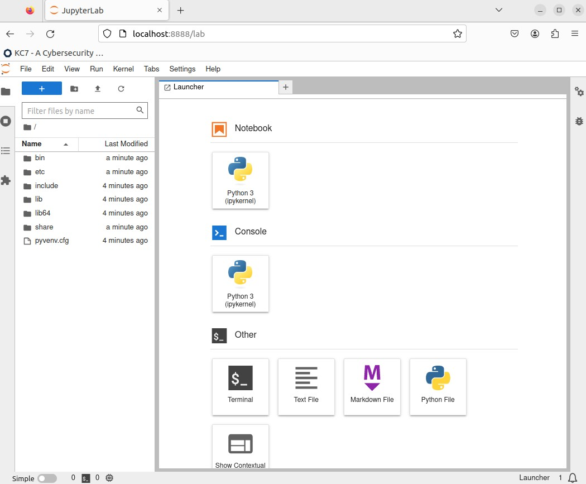
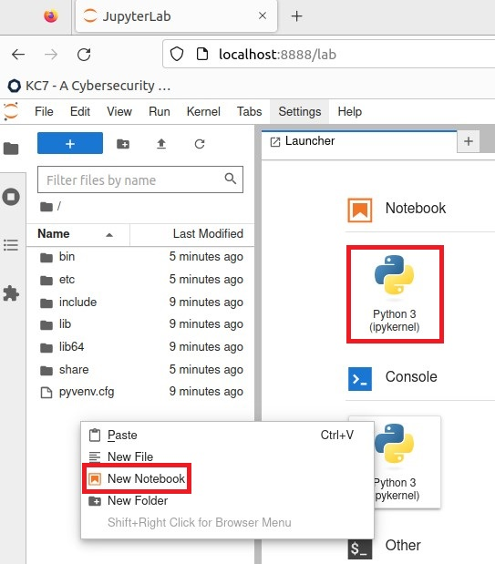
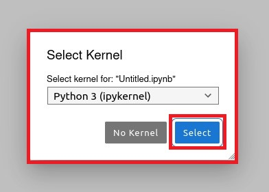
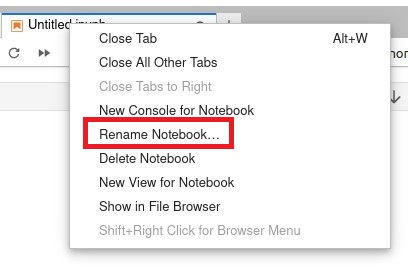
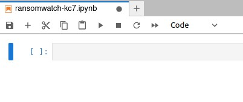

### **Difficulty Level: Advanced** 

##### **What you will learn:**
-  How to investigate various ransomware leak sites and obtain information from them 
-  Manipulate data using pandas & jupyter 

##### **Requirements:** 
- Linux Operating System 
- Python (version 3)
	- Jupyter Notebook 
	- Pandas 
- Git 
- (Optional)
	- Docker 

#### **Resources:** 
- Ransomwatch: https://github.com/joshhighet/ransomwatch

#### ⚠️ DISCLAIMER ⚠️
<hr> 

This content contains information from real world threat actors, and as such must be treated with caution. There is also references to real world victims that are being posted on these leak sites. In order to protect their privacy and not re-victimize them again, I will not be mentioning any victim names and any references to them will be redacted or removed. 

Proceed at your own risk and with caution. This is meant for an advanced threat intelligence audience. 

<hr> 

## 🗺 **Overview**  

We're going to be diving in to investigate the various ransomware leak sites that are being tracked by Ransomwatch. Ransomwatch is a great tool that allows threat intelligence analysts to keep track of ransomware actors and their leak site activity, and helps analysts find trends in a specific ransomware group's victim targeting. This includes looking for patterns in geographic region, industry sector, and any partner or adjacent companies that their company may interact with. Some analysts keep a feed of leak sites in order to stay informed of ransomware activity and to ensure they're the first to know if their company ever ends up on a leak site. 

## **📌Getting Started** 

### **Step 1: Install the required Linux packages

Let's make sure our environment is set up correctly. Open up a Linux terminal and run the following commands: 
```
$ sudo apt-get update
$ sudo apt-get upgrade 
```

Now let's install our required Python packages: 
```
$ sudo apt install python3-pip git
$ sudo apt install build-essential libssl-dev libffi-dev python3-dev
$ sudo apt install python3-venv
```

### **Step 2: Set up your virtual environment and install the required Python packages**

Navigate to where you want to save your Python environment and Jupyter notebook. In this case, I'm going to use my Desktop folder. 
```
$ cd ~/Desktop
$ mkdir kc7-projects
$ cd kc7-projects/
```

Now let's set up our Python 3 virtual environment and activate it: 
```
$ python3 -m venv ransomwatch
$ cd ransomwatch
$ source bin/activate
```

You should see the **"(ransomwatch)"** displayed on your terminal on the left side: 
```
(ransomwatch) kc7cyber@kc7cyber-dev:~/Desktop/kc7-projects/ransomwatch$
```

Let's do some installations via pip3: 
```
$ pip3 install pandas tabulate
$ pip3 install jupyterlab
```

Now let's clone the git repository: 
```
$ git clone https://github.com/joshhighet/ransomwatch.git

Cloning into 'ransomwatch'...
remote: Enumerating objects: 146898, done.
remote: Counting objects: 100% (1482/1482), done.
remote: Compressing objects: 100% (702/702), done.
remote: Total 146898 (delta 1252), reused 962 (delta 779), pack-reused 145416
Receiving objects: 100% (146898/146898), 843.13 MiB | 23.25 MiB/s, done.
Resolving deltas: 100% (134039/134039), done.

```

Let's install the required modules: 
- **Note**: you will need to edit the requirements.txt and set requests version from 2.26.0 to 2.28.0. 

```
$ cd ransomwatch/
$ pip3 install -r requirements.txt
```

Let's launch Jupyter 
```
$ jupyter-lab
```

A web page should pop up similar to the image below. If it doesn't, look at your terminal, there should be some links to open your JupyterLab environment using the URLs provided to you. 




## 📓 Creating the Jupyter Notebook 

<hr> 

🎯**Key Note - Why Jupyter?**
Jupyter is a great environment that allows you to build, test, and run code in small sections. It also provides you with a visual interface on a web page, and takes away the barrier needed to run Python code manually. The best part? Jupyter Notebooks can be shared amongst the rest of your team! 

<hr> 

Let's start by creating a new Notebook. You can right click on the directory tree to the left and click on **"New Notebook"** or click on the **"Python 3 (ipykernel)"** under the **"Notebook"** section on the **Launcher** page. 



- When asked to select a kernel, just use the default listing and click **"Select"**. 



- Right click on the tab with the new Notebook and click on 'Rename Notebook...' 

- Let's call it **"ransomwatch-kc7.ipynb"**



## ⌨️ Let's Code! 

### Path 1: The Easy Way 

One of the great things about joshhighet's ransomwatch is that it regularly already runs periodically and grabs posts from the groups listed in **"groups.json"**. The posts are then saved in the **"posts.json"** file. 

If we wanted just this information, we can build our notebook to pull this data pretty easily. 

- Let's import our modules:

```python 
# Created by: Waymon Ho (waymon@kc7cyber.com) 
# Import required Python modules

import json 
import requests
import pandas as pd
import os
```

- Now let's get the data: 

```python
# Get the posts.json that's regularly updated 
headers = {'Accept': 'application/json'}
response = requests.get('https://raw.githubusercontent.com/joshhighet/ransomwatch/main/posts.json', headers=headers)

# Set a JSON variable
resp_json = response.json()
```

- Looks like valid JSON. Let's go ahead and turn it into a pandas dataframe: 

```python
# Create a dataframe of the data
df = pd.json_normalize(resp_json)

# Print the dataframe
print(df)
```

- I don't really like how the columns are ordered, and I want to re-order the date to descending. 

```python
# Reorder the columns 
rdf = df[['discovered','group_name','post_title']]
rdf.sort_values(by='discovered',ascending=False)
```

## 🥳 🥳 

- Now I can save the data as a **CSV** if I want to by adding: 

```python
# Save to a CSV file 
rdf.to_csv('ransomwatch.csv',index=False) 
```

- But if I'm grabbing the list, maybe I want the date from when I grabbed it? 

```python
# Get today's date and use it on the saved CSV filename
from datetime import date
today = str(date.today())

# Save the dataframe
rdf.to_csv('ransomwatch-'+today+'.csv',index=False)
```

## 🎉🎉 Hooray! 🎉🎉

- Now that you have the concept code on Jupyter, if you create a Python script and save this file as **"ransomwatch2csv.py"** you can execute it using: 

```
$ python3 ransomwatch2csv.py
```

- A CSV file should now be created in the same directory with today's date. 

Stay tuned for more modules involving Ransomwatch. Some additional things to explore: 
- Modifying the parsers.py to obtain additional information of interest, including victim URL, descriptions, or other information about the victim on the hosted website. 
- Using the Azure Kusto Python modules to push data to a kusto cluster to use with your other data sources. 

## 👀 Other Ransomwatch Tools 


#### srcanalyser.py

You can run **"srcanalyser.py"** to analyze the saved scrapes in the **"source"** file. 

```
$ python3 srcanalyser.py 
```

The output will be put in the **"source/linkanalysis"** folder, where you can see any extracted urls, external urls, emails, phone numbers, or metadata. 

#### Docs 

The **"Docs"** folder contains additional statistics information including: 
- Summary Page: https://github.com/joshhighet/ransomwatch/tree/main/docs
- Recent Posts: https://github.com/joshhighet/ransomwatch/blob/main/docs/recentposts.md
- Profiles: https://github.com/joshhighet/ransomwatch/blob/main/docs/profiles.md
- Visual Stats: https://github.com/joshhighet/ransomwatch/blob/main/docs/stats.md


## 🔍 Appendix: Sample Code

```python
# Created by: Waymon Ho (waymon@kc7cyber.com) 
# Import required Python modules
# Filename: ransomwatch2csv.py

import json 
import requests
import pandas as pd
import os
from datetime import date

# Get the posts.json that's regularly updated 
headers = {'Accept': 'application/json'}
response = requests.get('https://raw.githubusercontent.com/joshhighet/ransomwatch/main/posts.json', headers=headers)

# Set a JSON variable
resp_json = response.json()

# Reorder the columns 
rdf = df[['discovered','group_name','post_title']]
rdf.sort_values(by='discovered',ascending=False)

# Save the file to a CSV
today = str(date.today())
rdf.to_csv('ransomwatch-'+today+'.csv',index=False)
```


## Need additional help? 

Join our Slack channel at https://kc7cyber.com/slack and ask us a question! 