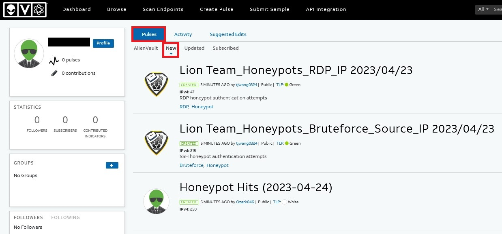

##### **What you will learn**
- What Alienvault Open Threat Exchange (OTX) is 
- How to incorporate Alienvault OTX into your workflow for threat intelligence investigations

##### **Requirements** 
- Web Browser

##### **Additional Resources** 
- Alienvault OTX: https://otx.alienvault.com/

## 🗺 **Overview**  

AlienVault Open Threat Exchange (OTX) is an open-source threat intelligence sharing and collaboration platform. It allows security researchers, organizations, and other users to share and receive information about threats and malicious activities they have encountered.

The platform collects threat data from a variety of sources, including its own network security products, user submissions, and other third-party sources. It then aggregates and analyzes this data to identify emerging threats and trends. The resulting threat intelligence can be used to inform security strategies, identify vulnerabilities, and protect against future attacks.

Some of the key benefits of using AlienVault OTX for threat intelligence include:

1.  Access to a wide range of threat data: By tapping into a large and diverse network of users and sources, OTX provides access to a wealth of threat intelligence data.
    
2.  Real-time updates: The platform is updated in real-time, providing users with up-to-date information on the latest threats and vulnerabilities.
    
3.  Customizable alerts: Users can customize their alerts and notifications based on their specific needs and interests.
    
4.  Integration with other security tools: OTX can be integrated with other security tools and platforms, allowing for a more comprehensive and streamlined approach to threat detection and response.
    

The best part about Alienvault OTX is that it's free. AlienVault OTX is a valuable resource for organizations and individuals looking to stay informed about the latest cybersecurity threats and trends.

#### ⚠️ DISCLAIMER ⚠️
<hr> 

Since Alienvault OTX is a free and community-led effort for threat intelligence sharing, anybody can sign up and contribute. It's important, that with any information you derive from Alienvault OTX, you validate against your own data and observations in order to make sure the information you're using is reliable and factual. 

<hr> 


## **📌Getting Started** 

Let's get started with Alienvault OTX by visiting their website at https://otx.alienvault.com/ and signing up for a free account. You'll need to verify your email address before proceeding. 

You'll hit the settings page and be able to set your account settings. If you're interesting in building an automated triage tool with Alienvault OTX, we'll use the OTX Key located in your settings page for a future data enrichment module on integrating Alienvault OTX to your workflow using Python. 

For now, let's go to our main dashboard and check newly created Pulses. Pulses are user-generated threat intelligence feeds that provide real-time updates on new and emerging threats.

Click on the Dashboard button and click on **New** Pulses. You can also visit this URL instead: https://otx.alienvault.com/dashboard/created




## ⌨️ Let's Hunt! 

On the top right of the dashboard, you have a search bar that allows you to search indicators or any keywords that you'd like to find on Alienvault OTX. 

![[otx-1.png]]

Let's say I have an unknown SHA256 hash I'd like to investigate: 

```
aa48acaef62a7bfb3192f8a7d6e5229764618ac1ad1bd1b5f6d19a78864eb31f
```

Let's search Alienvault OTX for that indicator. 

![[otx-2.png]]

Quite a bit of information was found on this file hash. It appears to be some sort of ransomware variant. We can click on Related Pulses to learn more about this hash: 

![[otx-3.png]]
It looks like it's associated with the Bablock AKA Rorschach ransomware. We can click on each of the pulses to learn more. 

**Note:** Alien Labs is the threat research component of Alienvault. These pulses are generally vetted and researched by their team before publication, so it generally contains detailed documentation and sourcing information. 

Looking at one of Alien Lab's pulses, we identify 52 indicators of compromise and 7 related pulses: 

![[otx-4.png]]

This type of information would be valuable to investigate in your environment to determine if you may be compromised by this threat actor. You can download the information in several formats, or create a Group to keep track of different pulses and threats that are of interest to you. Since you've investigated a single SHA256 hash on Alienvault OTX, you've now: 
- Identified that it is related to ransomware 
- Found that the ransomware variant is called BabLock aka Rorschach 
- Found 51 other indicators related to this threat
- Found 7 related pulses to review and gather more information about this threat 
- Found additional articles from security companies to learn more about this threat 

And this was all from one SHA256 hash! You can also search for IP addresses and other indicators to determine if they've been observed in any campaigns or threat actors. You can also search by adversaries and track them as well. Alienvault OTX allows you to subscribe to different authors and pulses, so that you can curate and keep track of threats that are related or important to track in your industry or company. 

## 🔍Other Features

Just like VirusTotal, Alienvault OTX can analyze files and URLs and provide details about the indicator you submitted at https://otx.alienvault.com/submissions.

![[otx-5.png]]

Alienvault OTX also has great API integration with a wide variety of threat intelligence tools. More information can be found at https://otx.alienvault.com/api. 

![[otx-6.png]]

**Note:** I've found that Alienvault OTX's API endpoint is generally faster than using the web UI version. I highly recommend exploring how you can integrate Alienvault OTX with your other threat intelligence feeds using Python or other tools. 

## 🎉🎉 Hooray! 🎉🎉

You've now signed up and used Alienvault OTX to search your first indicator. There is a lot of explore on Alienvault OTX, and I encourage you to explore and track threat actor groups that you're interested in. Often, if you see a security article or blog on a threat actor, you will most likely find that information on Alienvault OTX, with the indicators of compromise (IOC) and other related information extracted out in a digestable format for your threat intelligence feeds. 

Happy Hunting! 

## Need additional help? 

Join our Slack channel at https://kc7cyber.com/slack and ask us a question! 